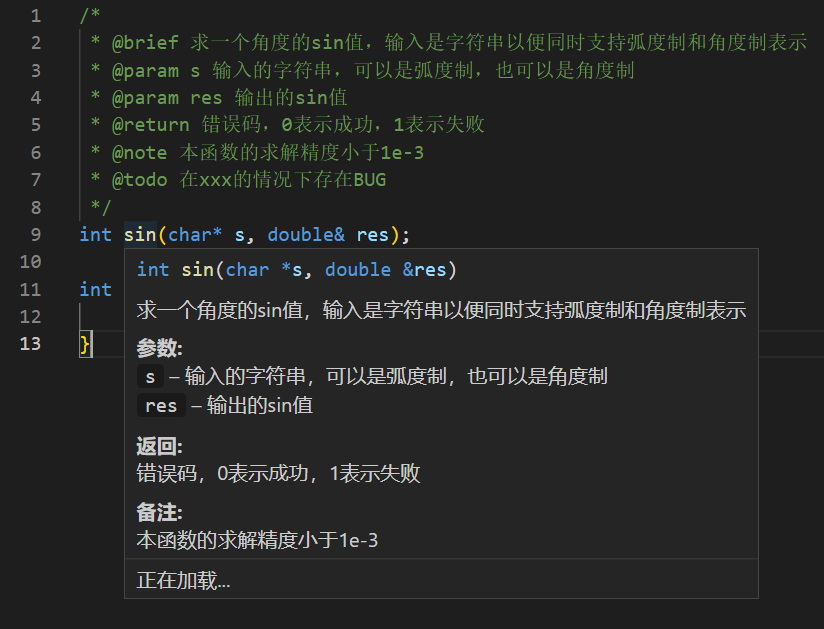
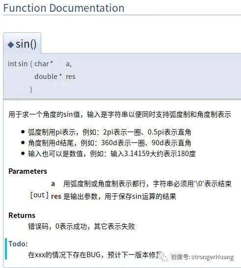

# 来自工程上的建议

## 面向对象

一本很知名的书曾提出 [设计模式：面向对象设计的六大原则](https://www.cnblogs.com/yeya/p/10655760.html) 不过这里面的要求可能过于苛刻了。

本次实验，我建议从两个点来考虑怎么面向对象设计。同时不一定要完全遵守，而是根据实际情况和自己的代码水平来选择。

### 解耦

通俗来讲，假如你实现一个**联网**，**带可视化界面**的**棋类AI**，现在有一个需求只要本地运行的AI，你的代码是否能够分离出来对应的类，或几个子类重新组装在一起，分离出来的内容，不包含联网或者可视化。可以就是低耦合度，不可以就是高耦合度。

一种高耦合的情况是：在实现下棋的时候，每个棋子就是一个按钮，导致如果想下棋，就得带着GUI库走。或者是网络库的那些 socket 也绑定在下棋里，要去掉得删代码。

低耦合的情况是：下棋的逻辑被单独包装成一个类，下棋的时候，先问下棋的逻辑这样走是否合法，如果合法，再把这个棋子的位置传给GUI类，让它显示出来。棋子位置的记录等等都保存在下棋的逻辑类里。同时下棋类被派生出带网络交互的类，这个类再和网络库产生联系。

把高耦合变成低耦合就是解耦

> 提示：在基类里预留未实现的接口，有时候可以避免派生类重写方法，同时又保证解耦

### 复用

相同功能的代码封装成一个函数或类，以重复使用。

这样的好处是，如果你的代码有bug，你只需要修改一处，就能够让所有的地方都不会有bug了。

> 提示：这会是大多数你觉得莫名其妙的BUG出现的原因之一，因为你第一眼以为这段代码或这个逻辑的BUG已经检查过了，更难受的是，你第一眼甚至不一定能分出来哪些是改过的对的，哪些是没改过的错的。

如果有一个本地棋盘，一个联机棋盘，他们的逻辑有很多重复的地方，又有一些不同，你就可以考虑在他们之上再抽象一个棋盘出来了，或者用复杂的继承简单的。

## doxygen

doxygen 是一种跨语言的文档管理系统，它可以借由一定格式的注释生成对应的文档。

如果你想要代码的注释规范化的同时，生成API接口的文档，甚至是类之间继承的关系图，使用这个标准是不错的选择。

[简要教程](https://zhuanlan.zhihu.com/p/510925324)

---

在 VSCode 中，借由 doxygen 格式，你可以做到这样：



有一些是 VSCode 不支持的，比如 `@todo`，但可以用在 doxygen 文档中。



## C++ style

每个人都有自己的代码风格，例如怎么给变量命名，文件命名，怎么注释，甚至是能不能用 `using namespace std`，怎么用。

业界公认的标准是 [Google C++ style guide](https://google.github.io/styleguide/cppguide.html)，中文版本是 [C++ 风格指南](https://zh-google-styleguide.readthedocs.io/en/latest/google-cpp-styleguide/contents/)，一个简化版 [一张图总结Google C++编程规范](https://blog.csdn.net/zyy617532750/article/details/81264648)。

如果你们小组需要一个统一的风格，可以参考这个。事实上，我建议所有人都了解这个风格。

## C++ standard

大家可以自行决定要不要自学C++现代标准中的语法和特性

```cpp
// bad style
std::vector< std::vector<int> > table;
for(size_t i = 0; i < table.size(); i++) {
    for(size_t j = 0; j < table[i].size(); j++) {
        int cell = table[i][j];
        std::cout << cell << std::endl;
    }
}

// good style
std::vector< std::vector<int> > table1;
for(auto row : table1) { // range-based for loop
    for(auto cell : row) {
        std::cout << cell << std::endl;
    }
}

//best style
using Row = std::vector<int>;
using Table = std::vector<Row>;

Table table2;
for(Row row : table2) {
    for(int cell : row) {
        std::cout << cell << std::endl;
    }
}
```

你可以参考这一篇文章 [现代C++标准浅览](https://zhuanlan.zhihu.com/p/595888665)，学习其中你觉得有用的。
