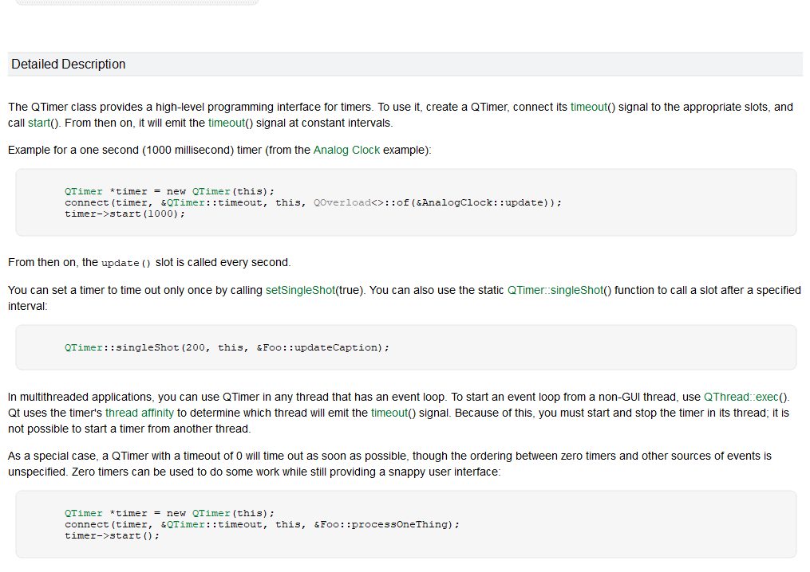
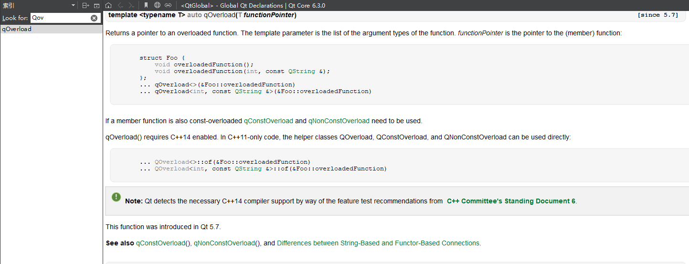

# 3月14日上机课

## QTimer

任何时候，官方文档都是最好的参考。它说 `QTimer` 会定时发送一个 `timeout` 信号，并且用 `timer.start(1000)` 和 `timer.stop()` 的方式开始暂停。所以下棋超时你就可以写个超时处理函数，然后把这个 `timeout` 信号和这个函数连接起来就可以了。

然后你需要注意两点：

- 如果触发一次超时了，那么你要把当前这个 `timer` 停掉，否则下一个周期它又超时一次。

- 如果没有超时，那么你要在他落子后提前把当前这个 `timer` 停掉，然后下一个人重新 `start`。

> 思考：如果要显示倒计时，你应该怎么做？



有时候文档看不懂，比如你看到

```cpp
connect(timer, &QTimer::timeout, this, QOverload<>::of(&AnalogClock::update));
```

一方面你可以接着查 `QOverload<>::of` 是啥，不过模板还没教，所以你可能会看不懂具体怎么回事。简单来说，它是用来区分同名不同参数的重载函数的，通过模板指定参数来获取对应的函数指针。



但话说回来，其实你已经知道 `connect` 的作用了，所以右边肯定是一个函数指针，它具体是什么我们并没有必要知道，我们本来就只是关心和 `timer` 有关的内容，也就是 `QTimer::timeout`，你把它在脑袋里面简化一下 `connect(timer, &QTimer::timeout, this, &AnalogClock::update);`，这样就很好理解了。

读文档的时候大胆假设，小心求证，这样你才可以快速了解一个东西的用法，然后不在意具体的实现细节。

## .DS_Store for macOS users

你不应该把 `.DS_Store` 这种无关文件提交到 git 仓库里面，具体见：

https://feyoudao.cn/pages/9f8029

## 大作业中的全局变量

根据之前的经验，会有很多组为了省事，把大量本该封装的变量放在全局里面，恨不得所有变量都是全局，到处都能随便调用才好，这样的问题是：

一方面这可能污染了全局命名空间，另一方面会降低代码的[可移植性](https://zh-google-styleguide.readthedocs.io/en/latest/google-cpp-styleguide/scoping/#section-6)，当然最重要的是，这不符合面向对象的思想。

总之，这不是一个好做法，你应该尽量避免这种情况。

> Google C++ Style Guide 中禁止了定义非 POD 的全局变量，所谓 POD 类型就是 `int`、`double`、`char` 等，而 `std::string`、`std::vector` 以及几乎所有你自己定义的类都不是 POD 类型。
>
> 详见：https://en.cppreference.com/w/cpp/named_req/StandardLayoutType

## 大作业提交时的文件编码

统一用 UTF-8 编码，从第零阶段的提交来看，应该只有第一组不是的，但其他组之后可能也会遇到，遂明确一下。

> 另外，如果有的组想提交 pdf 版的，或者是只想最后交一份报告的，或者是交一份报告但是每阶段更新的，原则上都可以，但我们不建议只最后的时候交一份，尤其是那些对自己作品比较自信的组，建议你们早点做完早点交，随时交，可能可以触发隐藏任务“热情帮助其他同学”从而得到加分。
>
> 原则上，这个大作业没有什么思路是不能借鉴的，只要代码是自己写的即可。

## 其他琐事

- 我把 code-style 文件夹改名成了 cpp，然后又加了一个 [`cpp.md`](../cpp/cpp.md)，里面新增了一些和本课程~~有关~~的资料。
- team10 加入了一位新同学，至此所有组都是3人组，原则上期末不再调人数分，但无论如何请放心，只要在认真完成大作业的前提下，我们会尽量保证每个组的分数是合理的。
- [nogo.panjd.net](http://nogo.panjd.net) 中更新了小组队名，**解锁了修改**，原则上，一直到比赛前，你们可以测试网站各种功能，如果有问题随时反馈。
- 有小组决定采用非 Qt 框架完成 ui 部分的设计，在反复沟通后，我们同意了这一请求，本着公平的原则，以下我们公开采用非 Qt 框架时的要求，但我们认为这是一件吃力不讨好的事情，我们不建议再有其他组提出这种要求：
  - 第一，你们的报告仍然要正常写，只是换个语言和框架而已，要写的内容差不多
  - 第二，网络库需要你们自己解决清楚，/network 下即是我们会提供的所有东西了，所以如果你们要用其他网络包，你们得自己重写，并测试兼容性，只要能和其他Qt的组正常通信就没问题
  - 第三，因为不同框架导致的问题需要你们负责，例如你们的代码和自己联机能跑，逻辑也是正确的，但不能和Qt的组通信，那么视为你们没有完成网络功能
  - 第四，因为框架不同，虽然我们的原则是尽量公平，因框架不同在给你们的代码打分的时候不可避免会出现一些误差（高或低），同时为了公平，用非 C/C++ 写的内容只能获得基本分，我们考察加分项比如算法和对象设计只在 C/C++ 的代码里
  - 第五，你们要控制最小量使用非 Qt 和 C/C++ 的东西（即原则上，所有功能代码都必须是 C++ 写的，唯一的区别是外面**多套**了层别的ui壳）
