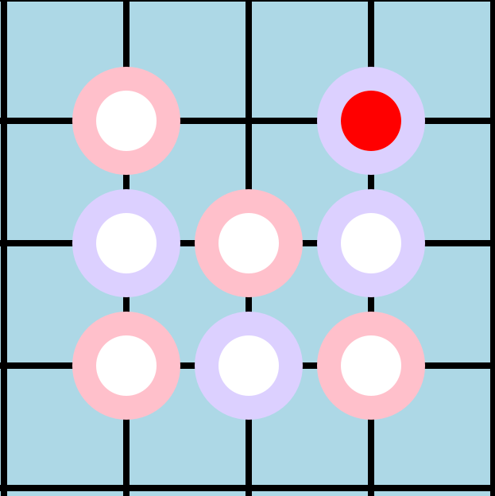

## Turing NoGo stage2 报告

### 大体分工：

陈宇轩：完成结算信息和本地储存，高亮最后一步和濒死提示。完成游戏联机逻辑的框架代码构建。

沈海涛：完善游戏联机逻辑的代码，协助调试网络问题，发现解决底层逻辑和指针问题。

付弋洋：协助完成联机和游戏逻辑测试debug和ui设计和美化以及阶段报告的书写。

### 内容概述：

在阶段二中实现了以下操作：

#### 游戏逻辑部分

##### 部分框架

```cpp
void MainWindow::on_time() //倒计时
void MainWindow::restat()//重开
bool MainWindow::save() //存储
bool MainWindow::read_in() //复盘
bool MainWindow::setting_show() //设置界面
```


1. 利用结构体实现了对于整个棋局过程的存储，目前可以实现复盘，并会标注每个落子的先后顺序。

   ```c++
   bool MainWindow::save() {//存储程序
       QFile file("item.txt");
       if (!file.open(QIODevice::WriteOnly | QIODevice::Text)) {
           //qDebug() << "Failed to open file";
           return false;
       }
       QTextStream out(&file);
       for(int i=1;i<jishu;i++) {
           out<<items[i].p_x<<char(items[i].p_y+'A'-1)<<" ";
       }
       if(you_giveup) {
           out<<"G";
       }
       if(out_of_timelimit) {
          out<<"T";
       }
       file.close();
       QString currentPath = QDir::currentPath();
       //qDebug() << "Current working directory: " << currentPath;
       return true;
   }
   ```

   

2. 丰富结算信息：包括 

  + 总步数
  + 游戏总时长
  + 黑方白方思考时长
  + 输赢原因和胜利方

3. 使用中心红点标注最后一步落子

   

4. 实现濒死提示

#### 联机逻辑部分

代码框架设计

```c++
public:
    explicit netting(QWidget *parent = nullptr);
    ~netting();// 服务端
    NetworkServer* server;// 客户端
    NetworkSocket* socket;// 最后一个客户端
    QTcpSocket* lastOne;
    QString IP;
    int PORT;
    QString nameE;// 客户端池，NetworkServer 有一个 QList 的，但这里我想用 set，所以又弄了一个
    bool already_connected=false;
    bool your_turn=false;
private slots:
    void receieveData(QTcpSocket* client, NetworkData data);
    void receieveDataFromServer(NetworkData data);
    void onClientSendButtonClicked();
    void onServerSendButtonClicked();
    void reStart();
    void reConnect();
    void reSet();
    void AsBlackClicked();
    void AsWhiteClicked();
    void namesetting();
```


#### 遇到的问题

+ 仓库问题：
  + 年轻的陈师傅惨遭团队排斥，代码传不进仓库，只能通过QQ传输，同时存在Mac和Windows在QQ上传不了代码的问题。
+ 代码冗长：
  + 初期设计的时候没有考虑到分模块，导致本地跟联机代码不能兼容，需要重新写，前面白干，后期梳理了一遍才能进行，但仍然冗长，重复颇多。
  + 小组内交流不充分，修改时没有相互约定，导致互相设绊子。

+ 联机连不上：
  + 这是一个非常愚蠢的问题，首先是我们尝试使用热点进行连接，导致IP地址有问题，难以在不同的电脑和系统连接。
  + 接下来我们在连接时又出现了填反了对方IP的乌龙事件（甚至叨扰了助教，悲）。然后我们尝试过在RUC-WEB和RUC-MOBIlE两个局域网上进行连接。
  + 联机信号收发处理失败，导致程序崩溃很久。
  + 在修改联机代码时，我们存在莫名其妙的版本倒退问题，本来的联机对战，变成了双方各自的本地游戏，甚是奇妙。
  + 倒计时修改的过程中，出现了各种各样的bug，这让陈师傅很伤脑筋。
+ 陈师傅压力队友的问题：
  + 陈师傅由于学习太积极，时常追问队友期中成绩，导致队友压力骤增。
  + 陈师傅五一旅游提前结束，全中国找队友，追加进度，状态外队友感激不尽。
+ 明德咖啡九点赶人问题：
  + 导致我们多次工作中止，不得不转移位置，浪费很多精力，差评。

### 特别鸣谢：

+ 感谢fyh对本小组第一个OP的启发性指导。

+ 感谢伟大的陈师傅主动提前结束自己宝贵的五一假期，回到学校赶进度。在此期间，他身患感冒，胃疼的同时，完成了六个OP的撰写,被团队奉为神明，犹如天上降魔祖，真是人间太岁神，这个陈宇轩，牛逼！！！！！！

+ ~~以下为fyy和sht等待陈神debug时的创作：《陈将军传奇》~~

  ​	*给他一个qt，他能踹翻ungo。他是中华五千年最年轻的将军，他的诞生轰动了整个世界。陈将军一岁时，智商就碾压了爱因斯坦。爱因斯坦曾表示：“当我看到陈宇轩将军的那一刻，我才知道宇宙为何名宇。”陈将军三岁时，就会用qt自主研发元神。五星上将麦克阿瑟曾这样评价陈将军：“如果上帝让我去阻止陈将军，那么我宁愿去阻止上帝。”*

  

+ 感谢沈海涛同志对陈宇轩的鼓励

+ 感谢助教的指导，并解决了陈宇轩未能上传代码的问题（垃圾vpn）

+ ~~感谢fyy友情提供的疯狂星期四炸鸡~~

+ 感谢立德楼晚上不赶人

+ 感谢🙏活着

