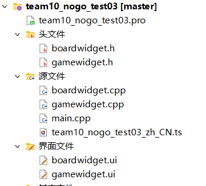
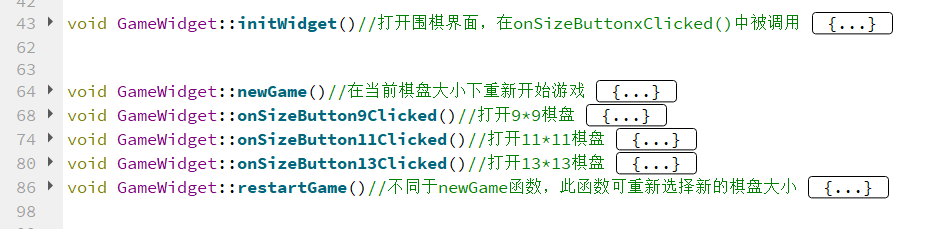
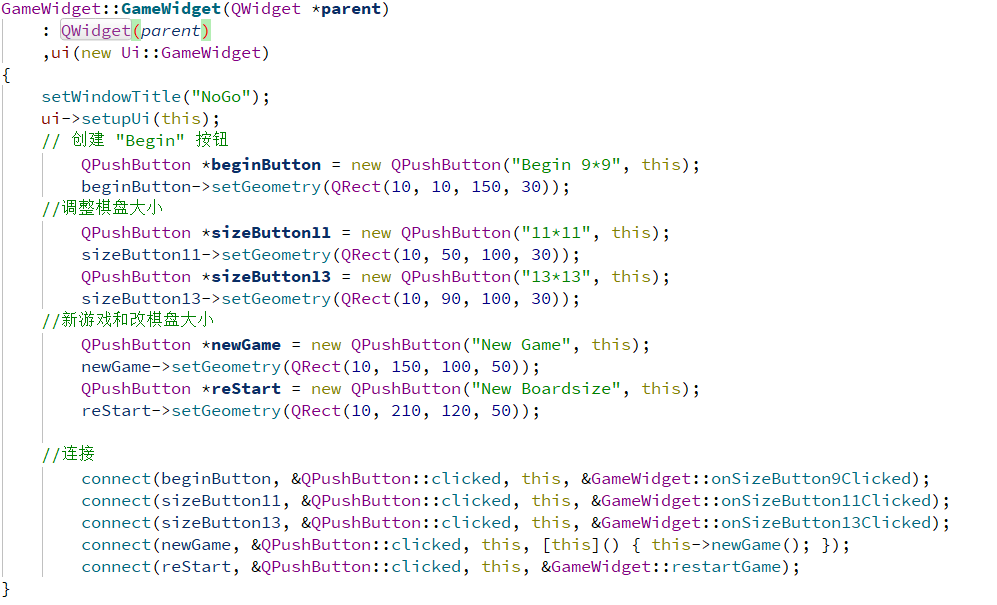
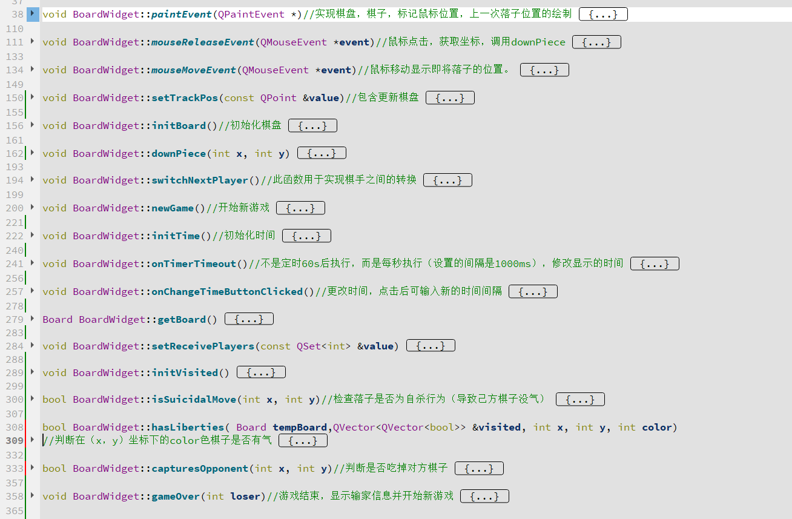
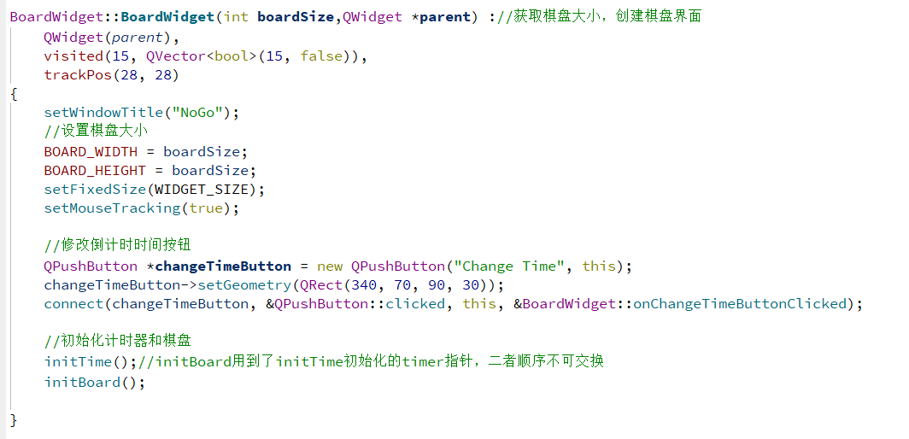
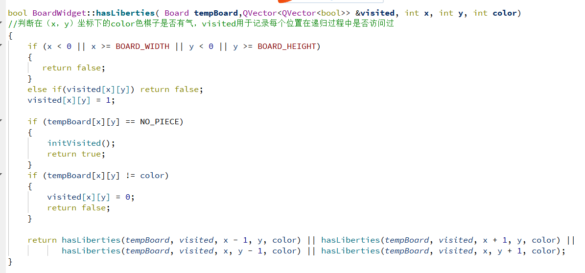
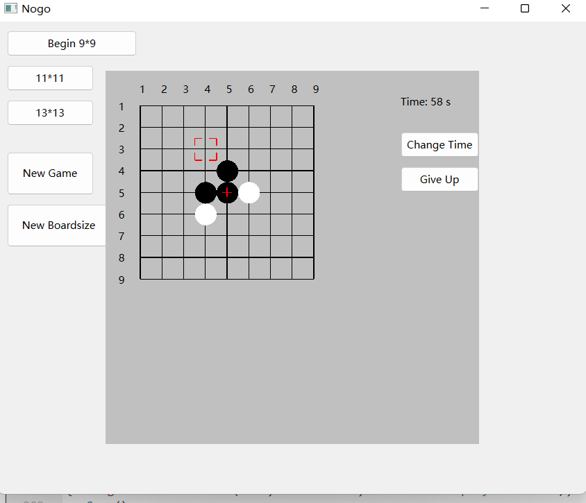
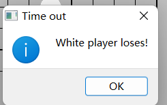

# 不围棋stage1实验报告——team10

## 大体分工：

董毅同学负责围棋界面的设计以及先后落黑白子的逻辑实现

祁文轩同学负责判断胜负以及不围棋规则的逻辑实现

冯悦同学负责计时与重新开始的逻辑实现，修改了开始界面实现换棋盘大小。

## 概述：

本组当前已实现棋盘大小调整功能，另有鼠标跟随事件的功能，可以让棋手清楚的看清自己下一步棋将落于哪个网格。各代码功能已有详细的注释，本部分报告展示部分代码。以下为实现框架（后期可能更改）

gamewidget负责初始化游戏状态，选择棋盘大小，重新开始游戏以及后续内部逻辑的实现。

包含：选择棋盘大小按钮   重新开始按钮  

选择棋盘后弹出boardwidget界面

boardwidget负责棋盘与棋子界面、先后落子以及鼠标移动事件，计时功能的实现

同时实现吃子，自杀，判断胜负功能

包含：棋盘    计时器   更改时间按钮   

## 代码介绍：

###       gamewidget中  

##### 主要函数及其作用

##### 构造函数（gamewidget界面实现）

###      boardwidget中：

##### 主要函数及其作用

####    

##### 构造函数（boardwidget界面实现）

胜负逻辑的关键在于判断是否有气的函数实现,此函数在判断是否吃子是否自杀中都有调用，使用**深度优先搜索**实现

## 运行界面

#### 游戏界面

#### 胜负判断界面

吃子，自杀，超时，认输均会弹出胜负界面，弹出名称Time out或Game over。

## 遇到的困难及解决

​    若一次运行程序先后进行两次不同棋盘大小的对局，总是崩溃。原因：已存在一个布局，只是hide了没有delete。

​    删除布局后还是没能解决问题，又因为解引用了空指针崩溃。  原因：delete后没处理指针，且必须使用类型转换后赋值给指针才不会报错，在这里卡了很久。

实现hasLibertities函数时出现未知bug导致board状态被莫名其妙更改，修改了记录已访问位置的方法后问题消失。

## 感谢

感谢孙亚辉老师和两位助教的悉心教导

感谢第十小组的成员

感谢中国人民大学和信息学院提供的学习平台