# 不围棋stage2实验报告——team10

## 大体分工：

祁文轩同学负责测试程序debug

董毅同学负责棋盘功能的完善

冯悦同学负责联网部分的实现

## 概述：

功能部分，本阶段本组完成了步数、结算信息、行棋记录、复现、高亮、投降、超时及濒死功能的实现，11 、13路的棋盘大小选择在stage1已经实现。网络部分，本组实现了聊天，发起、接受和拒绝对局等功能，日志系统通过qdebug输出接受和发送信号的时间和详情。各代码功能已有详细的注释，报告展示部分代码。以下为更新后的的代码实现框架

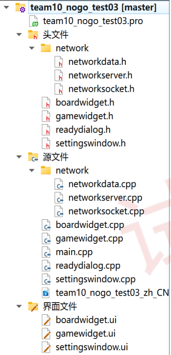

gamewidget中添加了服务端和客户端实例，信号的收发，新增PVP按钮

boardwidget中添加了步数、结算信息、行棋记录、复现、高亮、投降、超时及濒死功能实现的代码，

同时与gameWidget收发信号连接上相应的功能。

## 本阶段更新的代码介绍：

###       gamewidget中  

##### 在gamewidget 本阶段更新代码介绍： 类中添加如下变量：

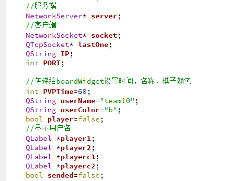

##### 在gamewidget中与联网相关的新增函数

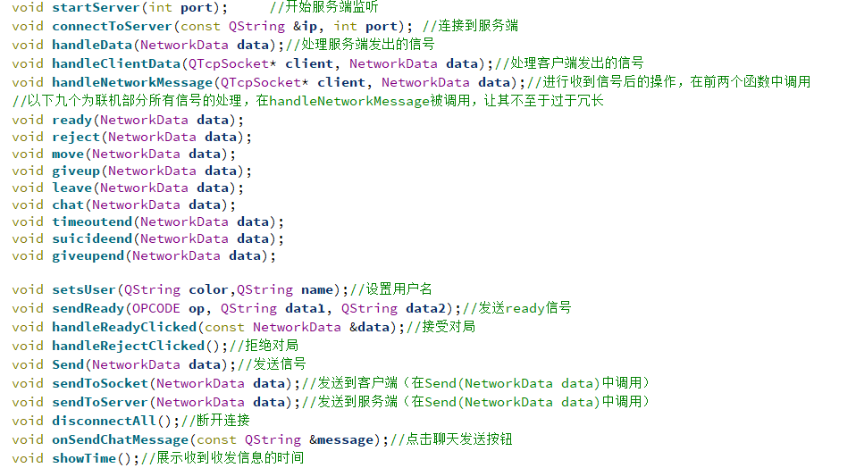

###      boardwidget中：

##### 在boardwidget 本阶段更新代码介绍： 类中添加如下变量：

####    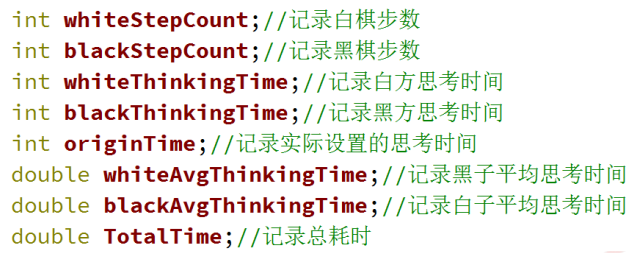

##### 在下列函数中实现棋局复现以及行棋记录

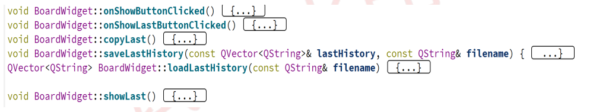

##### 更新投降按钮实现，加上行棋记录和PVP中发送信号

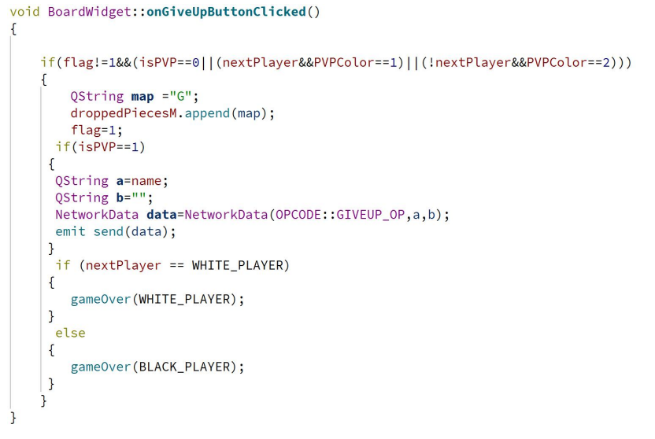

##### 在switchNextPlayer函数中新增记录思考时间的代码

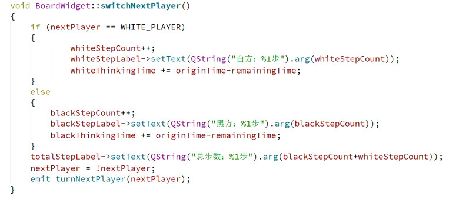

##### 新增的button及label：

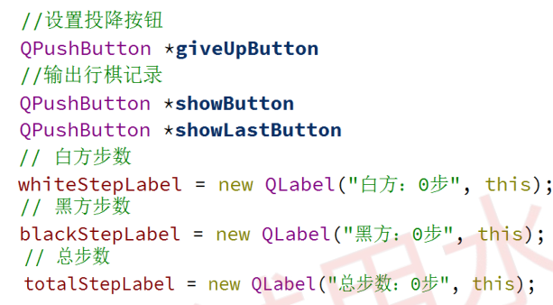

##### 完善的超时功能，实现超时的行棋记录和PVP发送信号

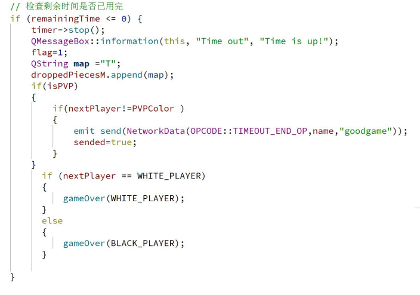

## 运行界面

#### 游戏界面

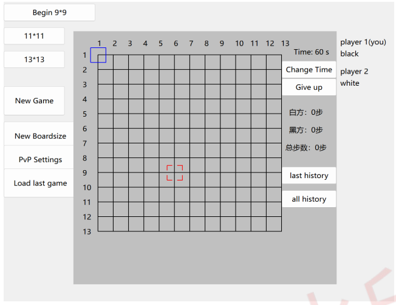

#### 联网界面

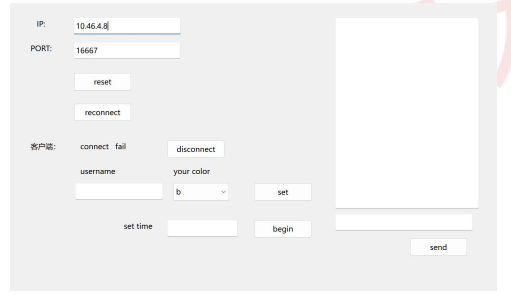

#### 胜负判断界面

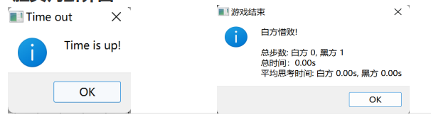

超时，认输均会弹出胜负界面，其中，超时会先弹出Time out界面，点击OK后出现游戏结束界面，而认输则直接显示游戏结束界面。

#### 濒死提醒

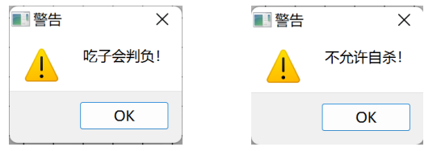

## 遇到的困难及解决

​    因为对ip不了解，不同设备连接出现问题，通过终端命令查看ip后解决。

​    出现了一台设备只能做客户端不能做服务端的玄学问题，目前原因未知。

## 感谢

无比感谢孙亚辉老师和两位助教的悉心教导

十分感谢第十小组的成员

再次感谢中国人民大学和信息学院提供的学习平台
