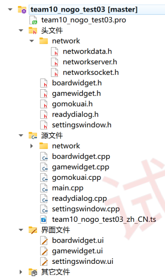
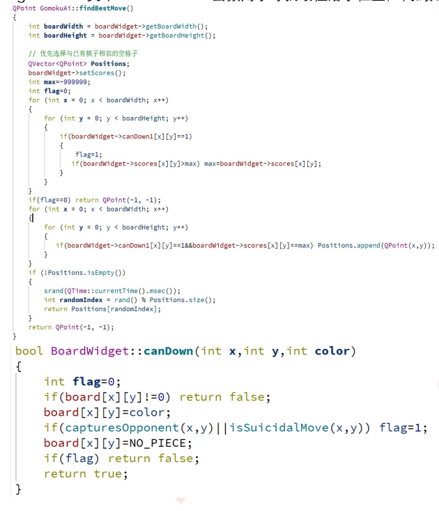
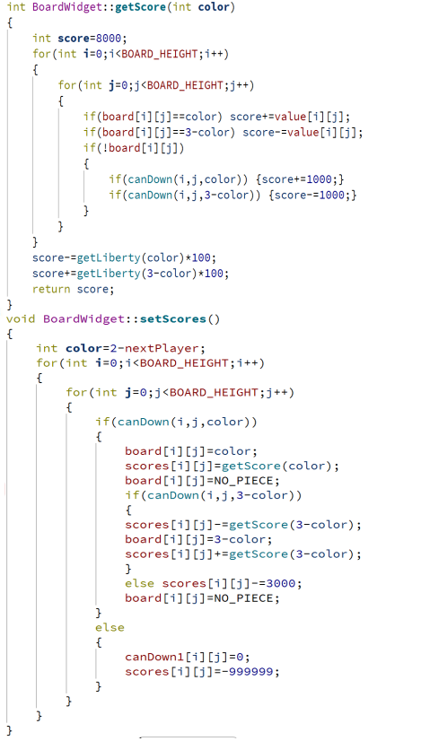
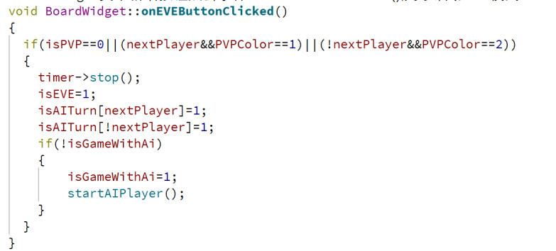
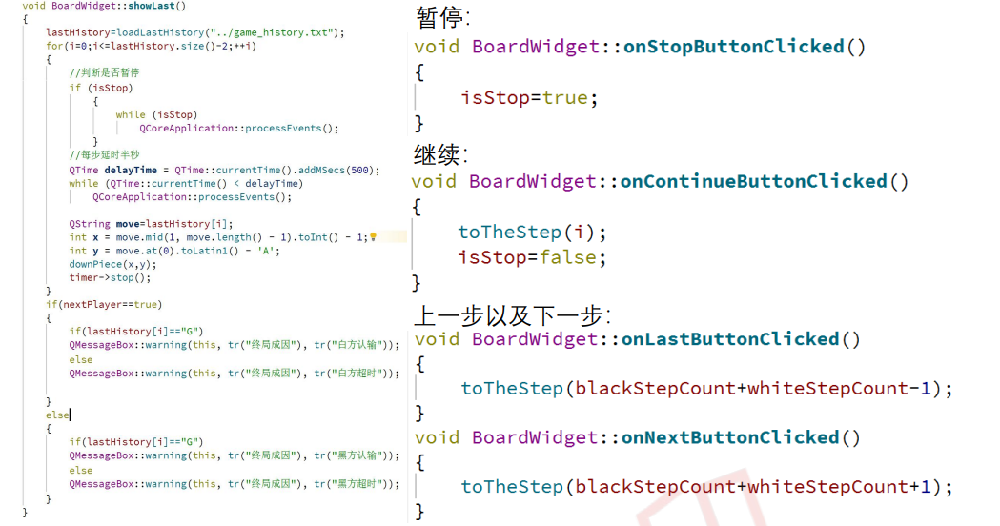
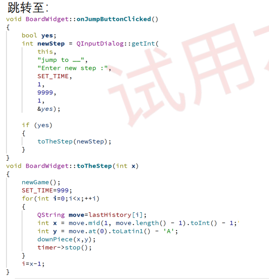
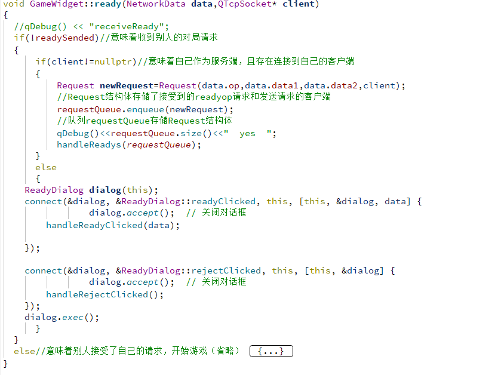
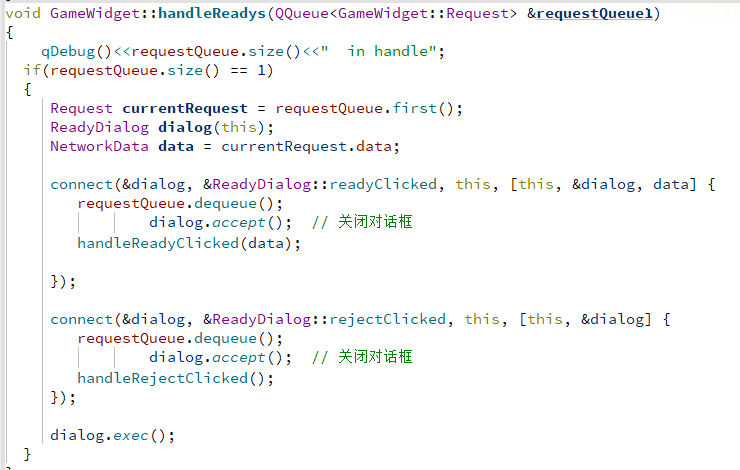
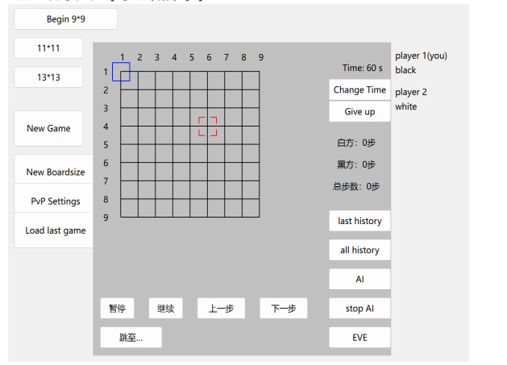

# 不围棋stage3实验报告——team10

## 大体分工：

祁文轩同学负责测试程序debug

董毅同学负责AI的初步实现 

冯悦同学负责AI算法的优化以及附加任务的完成

## 概述：

功能部分，本阶段本组完成了AI以及附加任务中的任务1、2、3、4。其中ai部分使用估值搜索的方法寻找最 佳位置，其他附加任务的功能实现都将有详细的描述。以下是最新的代码框架：

新增了gomokuai类，在其中实现了ai算法

boardwidget中新增了棋局复现的功能，实现了附加任务1和2，增加了计算当前局面得分相关的函数

gamewidget中修改了ready—op相关代码，实现附加任务3和4

## 本阶段更新的代码介绍：

###       AI实现部分：

本组设置的AI可在棋局开始或棋局中局中使用，在中局中点击AI按钮时，AI会自动将本该下一步落子的棋子颜色作为 AI方颜色。无论在何时点击EVE按钮，AI都会进行托管，本组的AI设置了0.5秒的思考延迟，以 下为AI和EVE功能的具体实现：

##### gomokuai类中findBestMove 函数用于寻找最佳落子位置：

##### 流程如下：

1.首先创建一个Positions对象，用于存储可能的落子位置。

2.接着调用 setScores() 函数遍历棋盘上的每一个空格子

（1）若此格子可落子：先计算自己落在此处后的局势得分A。再计算对方落在此处的收益大小B（若对方在此处不可落子则忽略）。将两者相加得到此位置落子的收益得分。（思路就是寻找自己的最佳位置，同时考虑提前占据对方的最佳位置）

（2）若此格子不可落子：将 canDown1数组中对应位置的值设为0(表示不可落子)，并将得分设置为一个较小的负值（-999999）。

3.遍历所有空格子，将可落子的位置（即 canDown1 数组中对应位置的值为1）添加到Positions对象中。如果存在可落子的位置，随机选择一个位置作为最佳落子位置，并返回该位置。否则，返回一个无效的位置 QPoint(-1, -1 )表示找不到可落子的位置。

以下为findBestMove 函数和与之相关函数的代码：

boardwidget类中新增按钮点击事件onEVEButtonClicked(),用于启动EVE模式

###      棋局复现部分：（实现了附加任务1和2）

该部分中，boardwidget类中新增的showlast()函数会从"../game_history.txt"文件中获取上一局的行棋记录，函数使用了' isStop'来判断是否暂停，若为真，则继续下一轮循环，否则停止。本组的棋局复现可以实现在任意时刻暂停后自由落子，但 在点击'继续'后将会清除新落下的子按原有的历史记录继续复现。以下为showlast函数以及其他复现功能的实现代码。

##### 

####    

##### 

### 更新的联机部分：（实现了附加任务3和4）

修改了ready—op信号的处理逻辑

1.ready函数中

（1）本机作为服务端接收到客户端的ready-op时，会将ready-op信号存储到请求队列requestQueue中，并调用handleReady函数。

（2）本机作为客户端收到服务端主动打出的ready-op会直接弹出是否接受的选项。

此函数保证了一局游戏结束后双方互换ready-op再来一局可以正常实现。

2.handleReady函数中，当请求队列requestQueue有且仅有一个请求时才会弹出是否接受的界面，因此多个客户端发送ready-op时只会显示出第一个发送者的请求。只有选择拒绝该请求后才会弹出后面的请求。若接受此请求会自动给其它发送ready-op的客户端回一个reject-op拒绝他们。

以下为相关函数实现：

## 运行界面

#### 游戏界面

#### 联网界面

   本组的游戏界面相对粗糙，但却精致且功能丰富。我们的设计注重简洁性和可操作性，在主界面 上就设计出所有直观而易于导航的菜单系统，以简洁的图标和清晰的标签呈现，通过直观的视觉反馈 和交互效果，使玩家能够快速找到所需的选项，确保老师和同学们能够轻松上手并享受游戏的乐趣。

 我们也注重人机交互的流畅性和响应性，能够确保游戏界面的操作流畅无卡顿，并提供了即时的 反馈和动态的游戏状态更新。我们独特的鼠标跟随事件也能够提高玩家的游玩体验，让玩家的每一次 操作都会立即反映在界面上，全身心地投入游戏，感受到真实而流畅的游戏体验

## 遇到的困难及解决

​    附加任务4的实现中，一开始没有注意队列操作中出队和读取的区分，导致handleReady函数判断队列元素个数时始终只有一个，让整个函数形同虚设。

调整出队的逻辑后功能就可以正常实现了。

（1收到ready-op—>2弹出队列中第一个请求界面—>3接受或拒绝）

（此过程中1加入队列，2只是读取，不出队，只有执行3以后才出队）

## 代码仓库 [[fyrisk/team10 (github.com)](https://github.com/fyrisk/team10)](https://github.com/fyrisk/team10/settings)

## 感谢

无比感谢孙亚辉老师和两位助教的悉心教导

十分感谢第十小组的成员

再次感谢中国人民大学和信息学院提供的学习平台
