# 2023程序设计II荣誉课程不围棋大作业报告
小组成员：周钰添 李越洋 杜聿焜

大作业仓库：https://github.com/Zhouyutian22/NoGoTeam3.git

## 一、小组的分工情况
>> 表格按照重要性和工作量排序
### stage1：
| 周钰添 | 李越洋 | 杜聿焜 |
| ------ | ------ | ------ |
|胜负逻辑|UI界面|代码调试|
|结算窗口|绘制落子|Debug|
|再来一局|认输功能||
### stage2:
| 周钰添 | 李越洋 | 杜聿焜 |
| ------ | ------ | ------ |
|联网逻辑|文件记录|代码调试|
|重构项目框架|多路棋盘|Debug|
|濒死提示|||
### stage3:
| 周钰添 | 李越洋 | 杜聿焜 |
| ------ | ------ | ------ |
|处理多申请的附加任务|复盘的全部附加任务|托管算法|
|托管功能|程序的打包||
|撰写实验报告|撰写实验报告||

**总体上看，周钰添设计了整体的项目框架，实现了tasks要求必做的逻辑与功能；李越洋贡献了可视化界面相关的实现以及对局存储与读取的重要功能；杜聿焜负责不围棋算法的研究，并参与了代码调试** 

## 二、开发历程与面向对象的设计
我们使用流程图来汇报，每一个框都代表一个类。
### 1. 在3月份的第一阶段，我们设计了三个类来实现本地对弈的基本功能。
* MainWindow（游戏窗口）：棋盘与棋子的可视化、处理鼠标点击事件、展示倒计时等信息；
* Game（游戏逻辑）：**深度优先搜索**判断胜负、QTimer实现倒计时、统计游戏信息；
* ResultWidget（结算窗口）：显示对局结果、再来一局功能。

这三个类具有良好的抽象和封装性，存储有游戏数据等属性，通过简单的信号与槽函数交互。
此外，李越洋同学设计了一个gochess类来辅助实现显示落子的功能。  

具体来说，MainWindow类在main函数中实例化，包含一个Game类对象，而在Game类中包含一个ResultWidget对象指针，MainWindow会将鼠标点击事件代表的坐标传给Game类，并进行胜负判断。若出现胜负情况，则用对局结果初始化一个ResultWidget窗口并显示。若点击了ResultWidget窗口的“再来一局”按钮，则Game对象和MainWindow对象均会初始化。
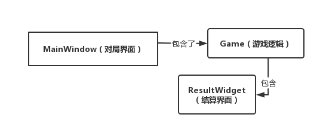  
### 2. 在4~5月初的第二阶段，我们设计了更完整的框架，主要设计了了3个类，实现联机对弈的基本功能。并在先前的Game类中添加了濒死判断、对局信息记录的功能。
* StartWindow（开始窗口）：可选择单机游戏或者联机游戏；
* NetWindow（联机窗口）：网络信号的处理与发送、联机对局；
* Request（对局申请窗口）：同意与拒绝申请、填写拒绝理由。  

第二阶段最主要的工作是NetWindow类的实现，在这个类中，我们实现了良好的封装性，函数调用逻辑简明。另外，对局信息的存储功能也得到了实现，我们搭建了复盘界面以待第三阶段的完善与实现。  
具体来说，我们将对于信号的处理都写在NetWindow类里，使用按钮来发连接其他机器或监听，通过接收或者发送`ready_op`来确定本机是服务端或客户端，进而进行联机的信息传输和游戏。这个阶段关于NetWindow类的工作在下一阶段有所修改，因此详情见下一阶段。
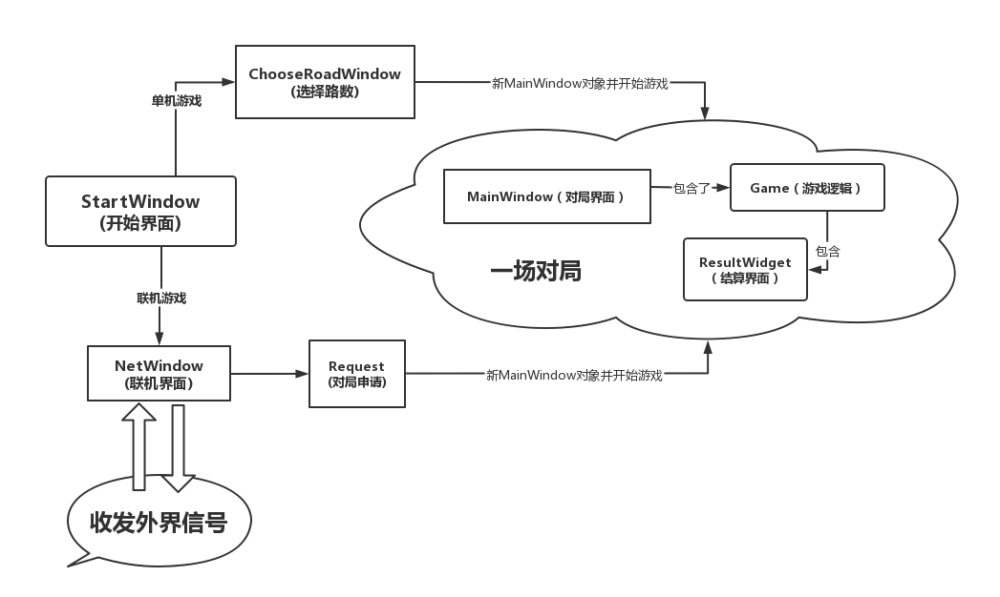

### 3.在5月份的第三阶段，我们完善了联机功能，实现了复盘的一系列功能，并实现了下棋托管功能。
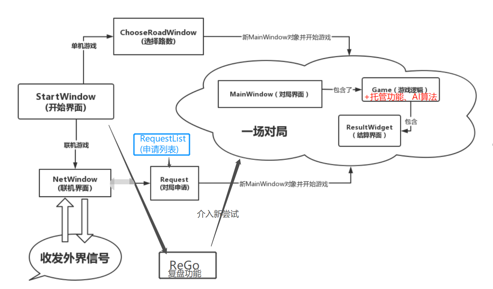

### **至此，我们所有游戏对局（单机、联机、“新的尝试”）都使用同一个游戏窗口，体现了复用性。 以下为主要窗口**
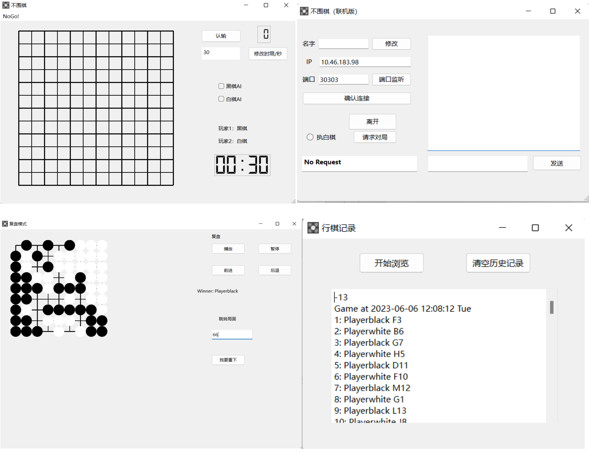

相比于部分其他小组将棋盘直接置于联机界面中，我们较好地利用了前一阶段的游戏窗口，使得每一个界面都比较**小巧简洁**  
值得注意的是，不管是单机还是联机的游戏结束后，我们并不需要确认该对局是否保存，而是无感记录；不需要确认对方是否自杀、投降，而是默认自动发送`give_up`等信号，这有利于解决联机对局中由于线程阻塞出现的一些bug，也在程序的实际使用中更加人性化。  
**关于不同类型的游戏（本地PVP/PVE/联机PVP/联机PVE等），我们在MainWindow类中使用协调统一的函数来减少代码的重复。如：**
```cpp
//该函数同时处理鼠标点击落子、MOVE_OP落子、AI落子。
void MainWindow::PutChessOn(int x,int y)
{
    QPoint point;                   //设置点
    point.setX(x);
    point.setY(y);
    
    goChess present(point,current);
    chesses.append(present);        //插入点
    
    game->CurrentPositionX=x;       //向game类传递落子位置
    game->CurrentPositionY=y;
                                    //如果是联机己方下棋的情况则发送MOVE_OP信号
    if(Going && NetMode &&
    ((MyColor == 1 && current == 1) || (MyColor == -1 && current == 0))) 
    emit Move(x,y);
    
    emit StartJudge();              //启动判断胜负
    
    current = !current;             //切换当前方颜色
}
```
**关于联机模式下客户端和服务端的不同情况，我们在NetWindow类中通过参数以确定，使得本机在同一次程序运行中可以实现不同情况的切换，运行流畅。如：**
```cpp
switch (ServerorSocket) {
    //作为服务端发出更新
    case 1:
        this->server->send(ConnectedOne,NetworkData(OPCODE::MOVE_OP,code,NULL));
        break;
    //作为客户端发出更新
    case 2:
        this->socket->send(NetworkData(OPCODE::MOVE_OP,code,NULL));
        break;
    default:
        break;
    }
```
这样的编程方式简单易明，简化了项目结构。
### 多路游戏的设计（**该部分以下报告为李越洋同学提供**）

本地游戏有9路、11路和13路3种模式，写了一个窗口来选择路径，窗口有3个QPushButton，点击后创建game对象，并分别将game对象的私有成员road值设置为9、11和13，在画棋盘和棋子，储存对局时均会用到这个成员变量。开始本地游戏时会弹出选择路数的窗口，这个选择路数的窗口由chooseroadwindow类实现，这仅仅是一个过渡的窗口，比较简单，不再展示。

在game类的构造函数中，road值初始化为9，这是因为在联机模式中并不会给予玩家选择路数的选项，联机游戏开始时默认为9路，而联机模式中仍然会用到game类，故设置road的默认值为9。

在MainWindow的cpp文件中仍然定义了宏

```cpp
#define ROWS 8
#define COLOMNS  8   //行数列数
#define WIDTH 30
#define HEIGHT   30       //棋盘格长宽
```

后两行的意义在于给定画棋盘时候绘制的网格的长宽，是一个常量，写成宏无可厚非（虽然在cpp中这个习惯不太好）。

前两行，在已经给定了路数并储存在game类的road成员里的情况下，仍然给了行数和列数的宏，似乎有点奇怪。这是因为开发网络部分在开发路数选择部分之前就开始了，起初我们把路数写成了宏，在联机模式的代码里很多位置使用了这个宏，后来因为联机模式只有9路，所以我们~~懒得~~没有一行行找并修改代码，而是为了方便直接保留了这个宏，在本地游戏中这个宏并无任何影响，因为那里涉及到路数信息的部分都用的是game对象的road成员值。


## 三、联机逻辑的设计
### **1. 我们使用二次封装的`NetWorkdata`、`NetWorkServer`、`NetWorkSocket`来实现联机功能，同时借鉴了助教师兄的`QTNetWorkDemo`库，实现了联机对战。**

对于联机模式，通过文本框输入`端口`后可以点击“端口监听”以打开监听，输入对方的`IP`并点击确认连接可以作为客户端连接其他机器。连接成功之后，可以点击“发起对局”以发起申请，也可以通过右侧聊天框发送聊天信息。  
对于客户端，状态栏在成功连接服务端后会显示“Connected as Socket”，而在发起对局邀请后显示“Waiting for reply”，一旦对方同意对局，会新创建一个MainWindow类对象并显示，并开始游戏。  
对于服务端，在客户端发送申请之前无反馈，客户端发送邀请之后会弹出RequestList窗口，显示邀请。


**这里使用了Qt内置的QListView控件，可以通过列表的形式展示数据。我们可选择点击某一条邀请以回复。**  
**作为一个附加任务**，我们成功实现了处理多申请的情况，在邀请数量大于0的时候，该窗口弹出，邀请数量等于0（或者是同意某邀请后，将逐一清空列表（发送拒绝）），此时将隐藏该窗口。

### **2.关于开始联机对局后的过程，两方轮流发送`MOVE_OP`信号。接收对方信号时将先在己方棋盘放置该棋子，然后启动胜负判断；我方鼠标点击落子（或者AI落子）时，优先发送信号，然后才启动判断。这样保证了赢方在对局结束时先发送`GG_OP`。**
在这样的设计下，我们信任对方的胜负判断，也保证己方的落子与判断逻辑正确。因此当收到对方的`MOVE_OP`时，我们立即放置棋子；对方发送`GG_OP`时，我们立即回复并结束游戏。这样设计虽然不能显性地反映对方程序漏洞，但是提高了程序的使用流畅性，防止线程阻塞。  

由于AI算法的设计，对方几乎不可能落子于“自杀”的位置。但是我们仍然在对方每次落子的时候启动胜负判断，使得`SUICIDE_OP`信号可以被及时触发。但是在正常过程中使用极少。

## 四、复盘功能的设计(**该部分报告由李越洋同学提供**)
## 储存对局

储存对局的功能写成了game类中的函数，包括初始化、储存和结束3个部分。

初始化函数game_init在创建了game对象和“再来一局”时gamereset函数里调用，主要作用为标记棋局开始、在项目构建的文件夹下打开mygame.txt文件准备写入（没有就创建一个），并记下这局游戏开始的时间。

储存函数go_write在每行一步棋时调用，向文件中写入棋子的颜色和坐标。

结束函数game_over在游戏结束时调用，通过结束的情况来判定胜者以及获胜方式，并写入文件。


本地游戏（11路）的游戏创建时调用game_init

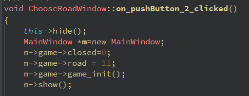

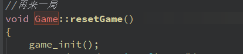

下图是在某一种胜负分出的情况下调用game_over的场景。

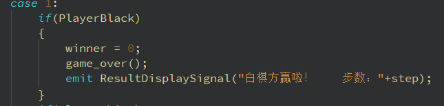

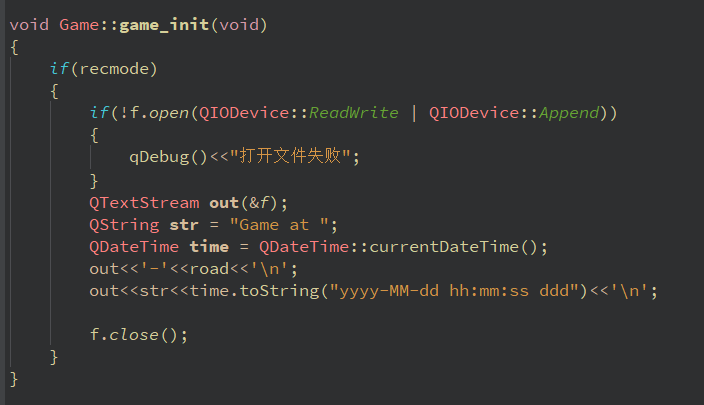

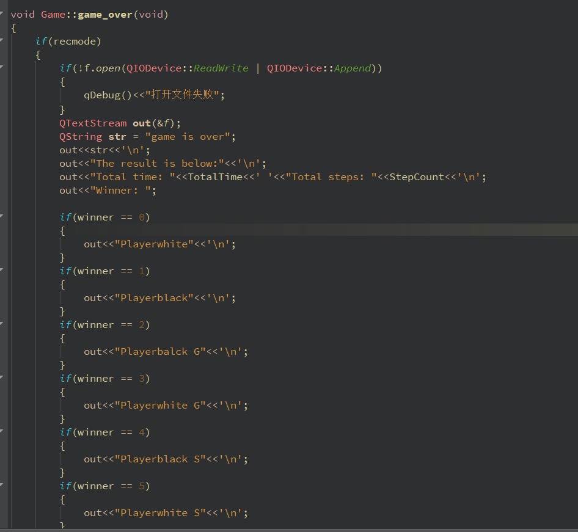

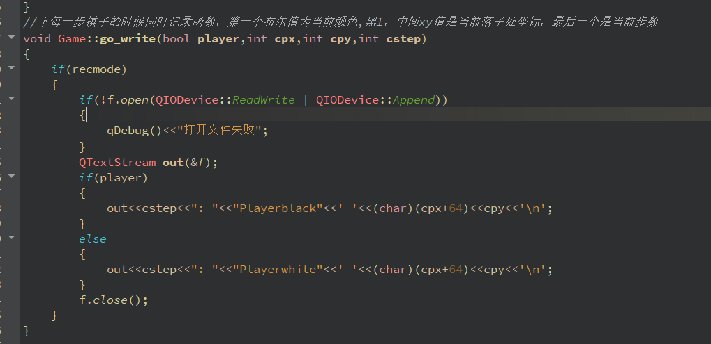

**另外，有一个想报告的事情是我们在写入对局记录的时候，格式并非严格按照“A1 B2 G”的格式进行，但采用了包含这种记录对局格式的“棋谱”形式，从中可以看到棋子的坐标（横行为大写拉丁字母，纵行为数字的形式）以及对局结束时的状况（G,K等），如下图。**

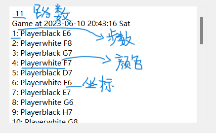

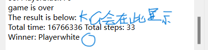

## 复盘模式

### readrecords 和 regowindow 

regowindow类是复盘模式的总窗口，它包含两个QPushButton，分别对应查看对局记录和复盘功能，属于过渡性质，功能比较单调。

readrecords类包含2个QPushButton和1个QTextEdit，负责展示mygames.txt文件中储存的对局，并可以删除记录。

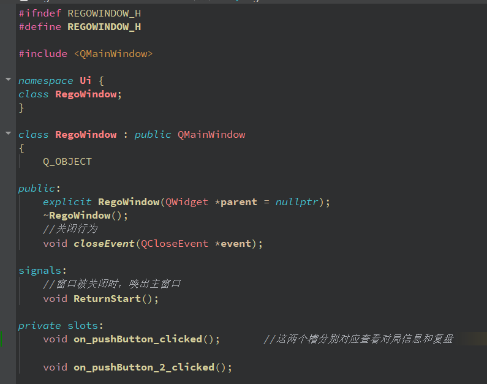
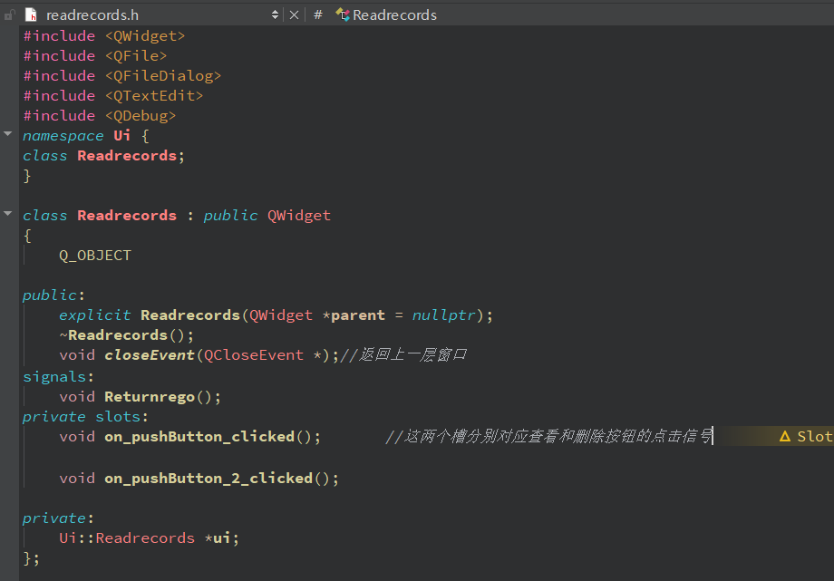
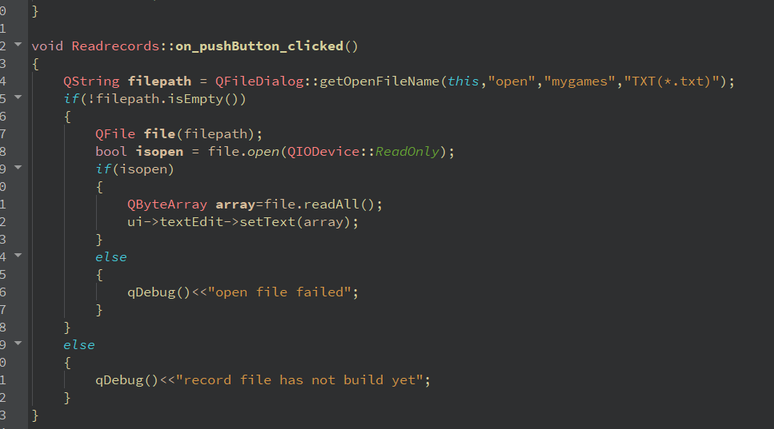
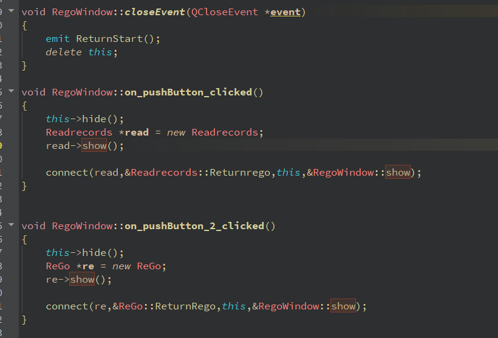

### rego

rego是复盘功能的集大成者，包含了读取mygames.txt中 **最近一局** （因为没要求具体复盘哪一局所以只做了复盘最近一局）并且储存在静态2维数组成员中。rego类的头文件如下图所示。

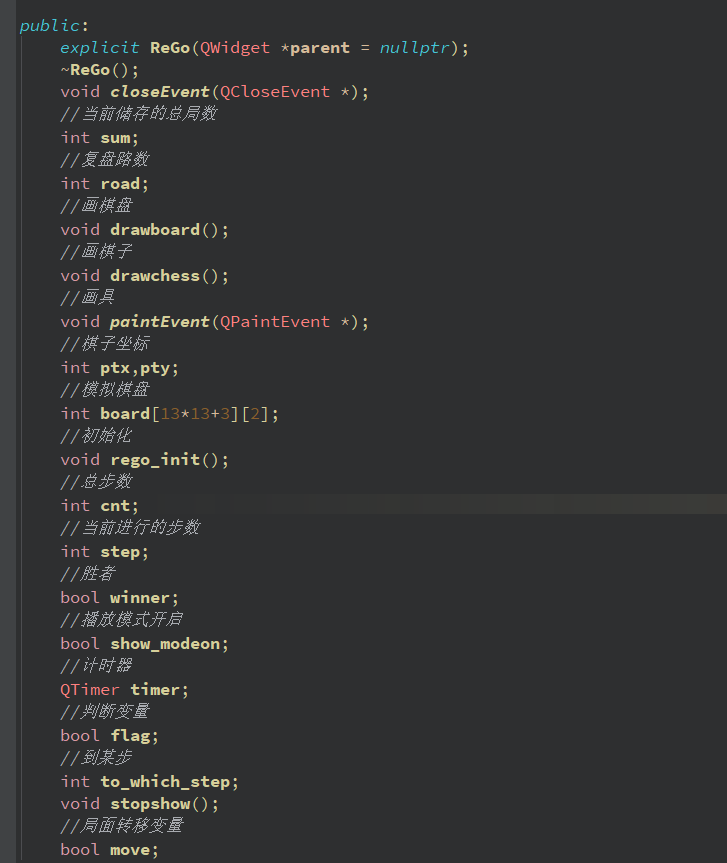
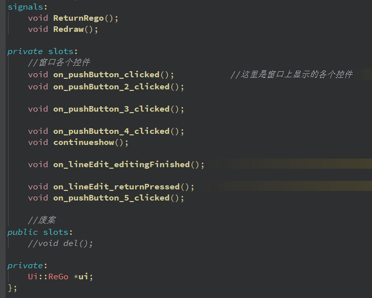

下图是构造函数

跳转局面的输入框里使用了正则表达式，使这个输入框里面只能输入能正确表示非负整数的字符串。

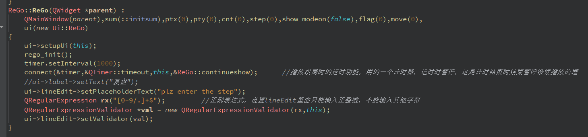

下图是窗口展示。

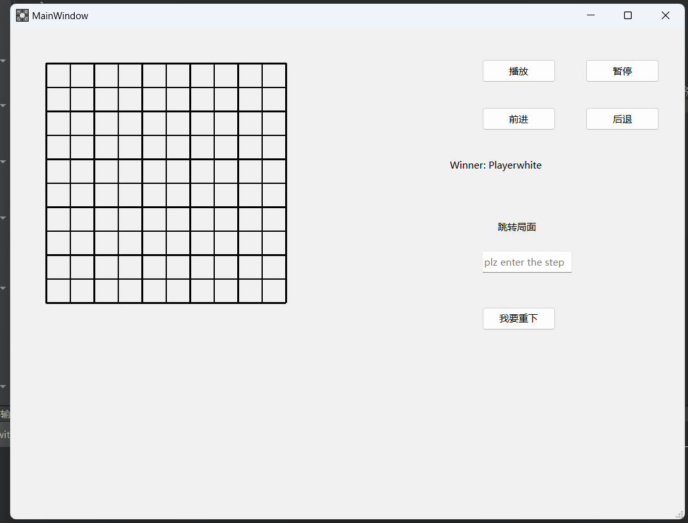

下面是初始化函数的代码

```cpp
void ReGo::rego_init()              //初始化
{
    QString path = QFileDialog::getOpenFileName(this,"open","mygames","TXT(*.txt)");        //打开并阅读文件，从中得到上一局对局记录
    if(!path.isEmpty())
    {
        QFile f(path);

        if(f.open(QIODevice::ReadOnly))
        {
            char *str = new char[::maxsize];
            qint64 readstr = f.readLine(str,::maxsize);
            if(readstr==0)
            {
                qDebug()<<"No games saved!";
                emit ReturnRego();
            }
            else if(readstr == -1)
            {
                qDebug()<<"error in reading";
                emit ReturnRego();
            }
            else;

            while(readstr!=0&&readstr!=-1)          //统计当前局数
            {
                if(str[0]=='-')
                    sum++;

                readstr = f.readLine(str,::maxsize);
            }
            delete []str;
            f.close();

        }
        else
        {
            qDebug()<<"open fail";
            emit ReturnRego();
        }

        if(f.open(QIODevice::ReadOnly))
        {
            char *str = new char[::maxsize];
            int current = 0;
            qint64 readstr = f.readLine(str,::maxsize);

            while(readstr!=0&&readstr!=-1&&current<sum)          //统计当前局数
            {

                if(str[0]=='-')
                    current++;

                if(str[2]=='\n')
                    road = (int)(str[1]-48);
                else
                    road = (int)(str[1]-48)*10+(int)(str[2]-48);
                readstr = f.readLine(str,::maxsize);
            }

            qDebug()<<road<<' '<<sum;
            //getchar();
            readstr = f.readLine(str,::maxsize);        //按行来读，根据储存的格式，找到记录棋子位置的信息，读取并转化为int值储存在静态二维数组中
            while(str[0]!='g')
            {
                if(str[1]==':')
                {
                    ptx = (int)(str[15]-64);
                    if(str[17]=='\n')
                        pty = (int)(str[16]-48);
                    else
                        pty = (int)(str[16]-48)*10+(int)(str[17]-48);
                    board[cnt][0] = ptx;
                    board[cnt][1] = pty;
                    cnt++;
                    //qDebug()<<ptx<<' '<<pty;
                    readstr = f.readLine(str,::maxsize);
                }
                else if(str[2]==':')
                {
                    ptx = (int)(str[16]-64);
                    if(str[18]=='\n')
                        pty = (int)(str[17]-48);
                    else
                        pty = (int)(str[17]-48)*10+(int)(str[18]-48);
                    board[cnt][0] = ptx;
                    board[cnt][1] = pty;
                    cnt++;
                    //qDebug()<<ptx<<' '<<pty;
                    readstr = f.readLine(str,::maxsize);
                }
                else if(str[3]==':')
                {
                    ptx = (int)(str[17]-64);
                    if(str[17]=='\n')
                        pty = (int)(str[18]-48);
                    else
                        pty = (int)(str[18]-48)*10+(int)(str[19]-48);
                    board[cnt][0] = ptx;
                    board[cnt][1] = pty;
                    cnt++;
                    //qDebug()<<ptx<<' '<<pty;
                    readstr = f.readLine(str,::maxsize);
                }
                else;
            }
            while(str[0]!='W')
            {
                readstr = f.readLine(str,::maxsize);
            }
            if(str[14]=='b')
                winner = 1;
            else
                winner = 0;

            ui->label_2->setText(str);

            qDebug()<<cnt;
            delete []str;
            f.close();
        }
        else
        {
            qDebug()<<"open fail";
            emit ReturnRego();
        }
    }
    else
    {
        qDebug()<<"file does not exist";
        emit ReturnRego();
    }
}

```

本人水平所限制，因此略显繁琐。

大致上，这个函数使用了QtFile的常用方法，先用只读模式打开了mygames.txt文件，然后先检查它是不是空的，若不是，则用readline方法逐行阅读，根据之前储存对局的格式检查一共有储存了多少局游戏（每一局游戏前会有一个“-”字符，表示一局游戏开始），然后，在最新一局的记录标记（即储存的倒数第一局游戏前的“-”字符）前停下，再逐行阅读，根据棋子坐标出现的位置一个个地将它们储存到静态2维数组中，数组的第1维表示的是步数，第2维表示的是横纵坐标。当读到“game is over”字符串时，说明本局结束，再读下一行，下一行储存的是胜者，此时停止阅读。这样，我们就获取到了这一整局游戏的信息，包括每一步的信息、最终胜者和取胜方式（对方认输、自杀）、路数以及总步数等。

画棋子和棋盘的函数和mainwindow类中的大同小异，此处不再展示。

### **复盘中的附加任务1**

以下是QPaintEvent函数的代码，这里包括了前进、后退、播放、暂停、跳转时的绘画动作，使用了一系列的布尔变量来控制模式，这些布尔值的改变和窗口中按钮、对话框的动作用信号和槽连接起来了。更新画面仍然采用了update方法。

```cpp
void ReGo::paintEvent(QPaintEvent *)
{
    if(!show_modeon)
    {
        if(move)
        {
            if(to_which_step>=0&&to_which_step<=cnt)
            {
                step = to_which_step;
                update();
                    move = 0;
            }
            else
            {
                QWidget *w = new QWidget;
                QLabel *l = new QLabel(w);

                l->setText("步数错误！");
                move = 0;
                w->show();
            }
        }
        else
        {
            drawboard();
            drawchess();
        }
    }
    else
    {
        if(move)
        {
            if(to_which_step>=0&&to_which_step<=cnt)
            {
                step = to_which_step;
                update();
                move = 0;
            }
            else
            {
                QWidget *w = new QWidget;
                QLabel *l = new QLabel(w);

                l->setText("步数错误！");
                move = 0;
                w->show();
            }
        }
        else
        {
            drawboard();
            drawchess();
            stopshow();
            timer.start();
            if(step<cnt)
                step++;
            else;
        }
    }
}
```

下面是信号槽

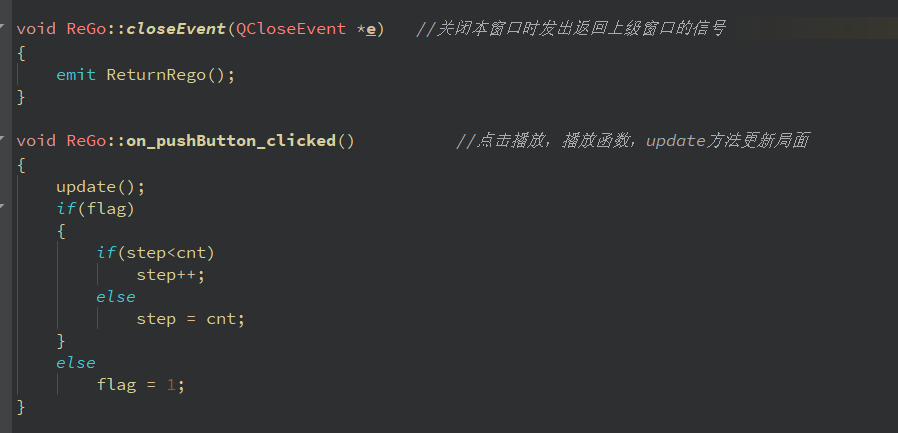
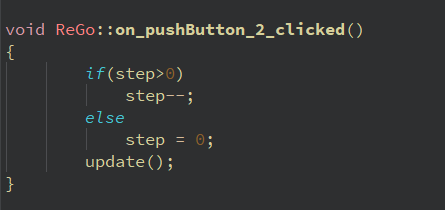
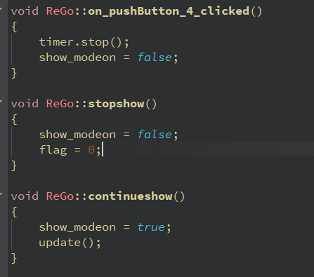

### **附加任务2**

实现了在某步暂停重新下，本质上是重开一局游戏并且提前传入之前已经复现过的步数信息，从当前的步数开始重新下。但略有bug，可能和QTimer设定的延时时间中点击重下时step变量的变化有关，这个bug就是在点击重新下的时候，创建新的game对象和游戏窗口mainwindow之后，传入已经复盘过的步时可能会少传1步（有概率触发）。
代码如下图。

## 五、AI算法的设计
我们组使用估值与贪心的算法，过于简单，在此不作展开。

## 六、闲话与致谢
本次课程实践让我们充分学习了QT的使用方法，以较为粗糙的风格实现了一个联机的不围棋游戏，充分体现了图灵实验班课程的硬核程度。总体上看，我们小组合作有序，分工明确，但是也真正呼应了队名“DDL战神”，多次压着提交时间完成任务。这是我们大学来第一个充分合作的编程项目，第一次使用了GitHub来协作，但是使用不深。不管怎么说，我们还是基本完成了大作业的全部要求，尽力减少漏洞，这是一次难忘的合作经历。

* 感谢孙亚辉老师，潘俊达助教，王卓冉助教在学习和生活上的关心和指导
* 感谢小组成员们的共同努力与耐心协作
* 感谢其他小组与我们组进行了充分的相互测试。
* 感谢中国人民大学信息学院提供的教学平台