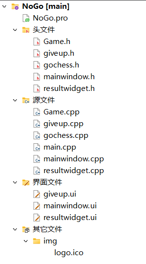
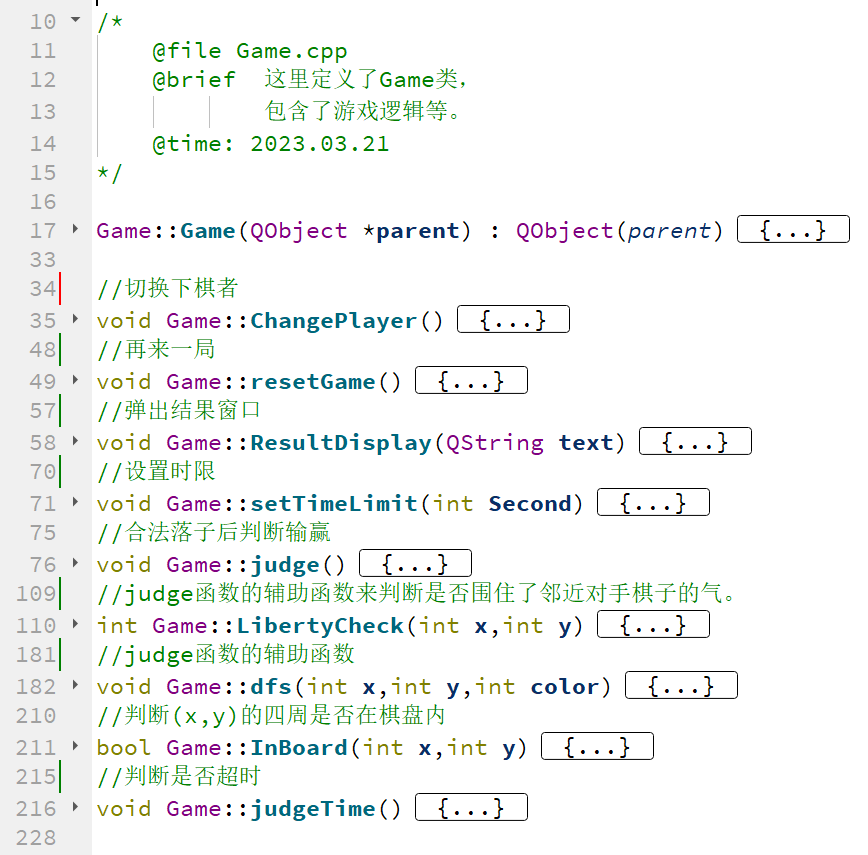
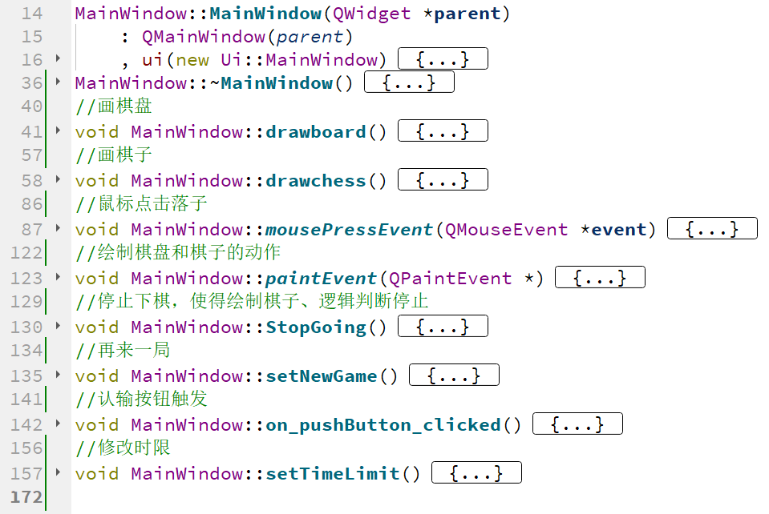
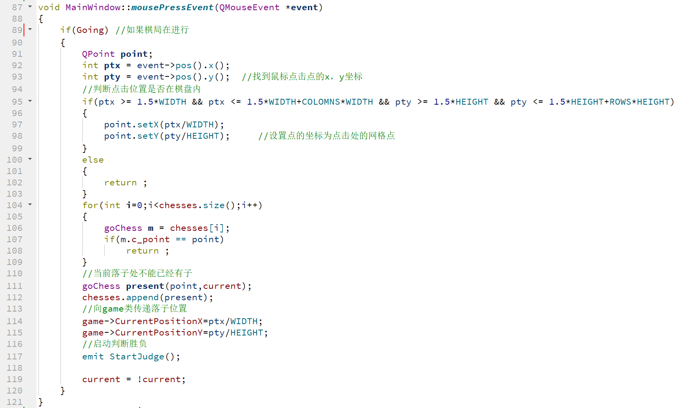
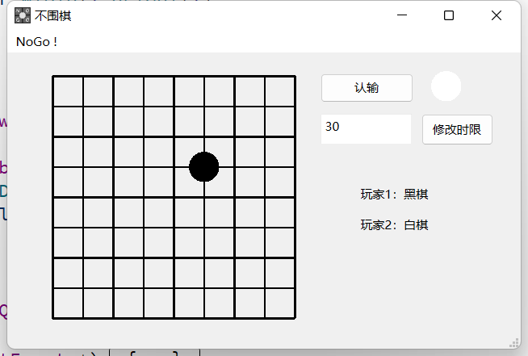
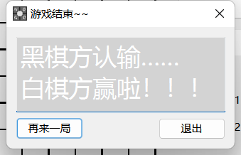
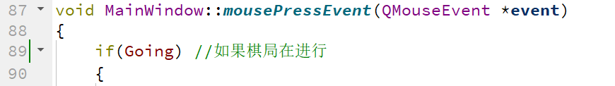
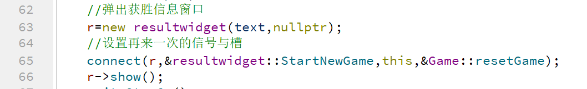
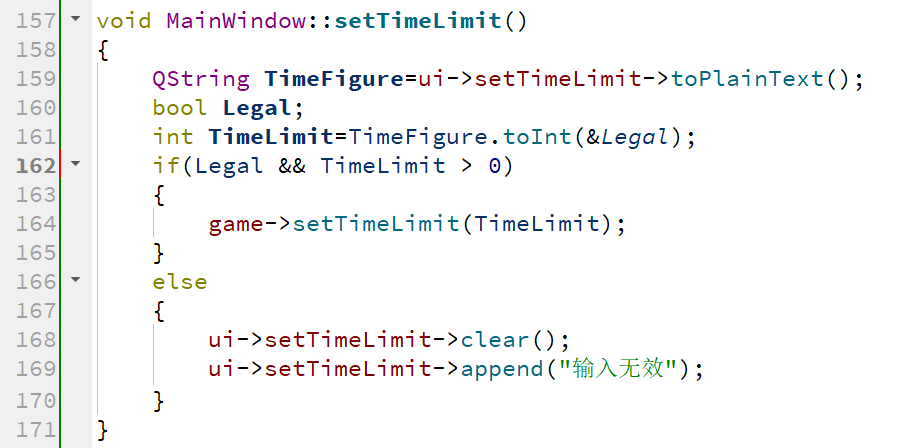

# 程序设计2荣誉课程Qt大作业第一阶段实验报告
> 周钰添撰写

## 组员分工
>按照时间顺序

| 周钰添 | 李越洋 | 杜聿焜 |
| ------ | ------ | ------ |
|胜负逻辑|UI界面|代码调试|
|结算窗口|绘制落子|Debug|
|重置功能|认输功能||
|时限设置|||

## 代码框架设计

* 我们将游戏逻辑部分放在了Game类中，内含有结算窗口resultwidget类  

* mainwindow类中实现了一系列交互功能。

* mainwindow类的落子函数

* 我们将认输功能giveup类单独拿出，便于小组成员协作
> 类和文件的拆分是我们追求低耦合所做的努力
### **关于UI界面**
  
* 手绘LOGO~
* 使用线条绘制棋盘，用纯色的圆表示棋子，体现简约小作坊风格
* 认输和时限按钮依次排列，方便点击
* 右侧用棋子颜色提示当前落子方

### **关于结算界面**
* resultwidget类结合了可视化和代码编程，实现了不同结果（吃子、自杀、认输、超时）的展示，并实现了再来一局功能。

### **关于落子**
* 如果点击已经有棋的位置或者棋盘外部等非法位置，不会有提醒和代码错误产生，**我们包容误触和故意触碰~**
* 合法落子后使用**深度优先搜索算法**判断是否产生输赢。
* 在结算界面点击“再来一局”会清空棋盘，点击“退出”则保留棋盘，且点击后不会产生操作。

## 遇到的问题和解决方法
1. 在结算退出后仍然能够落子并显示，出现多次输赢的情况。
> 解决办法：在mainwindow类中添加布尔变量Going以判断棋局是否在进行。

2. 使用connect函数连接结算界面使得程序产生崩溃。
> 解决办法：原因在于connect函数放在构造函数内时，结算界面类对象的指针为空。因此将connect函数放在结算界面对象构造后即可。

3. 修改时限时遇到不是数字的输入难以判断。
> 解决办法：设置布尔变量Legal，使用toInt函数时如果返回合法，则Legal为true，反之为false，向文本框发送“输入无效”

## 感谢

* 感谢孙亚辉老师，潘俊达助教，王卓冉助教在学习和生活上的关心和指导
* 感谢小组成员们的共同努力与耐心协作
* 感谢中国人民大学信息学院提供的教学平台