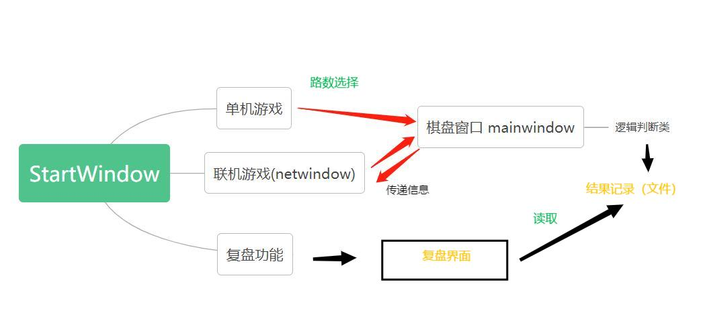
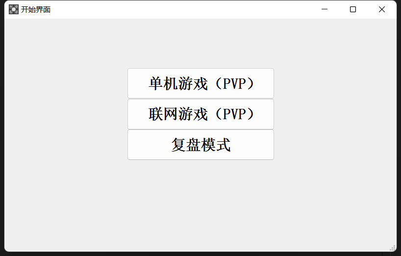
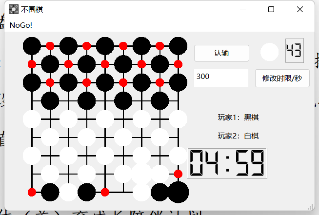
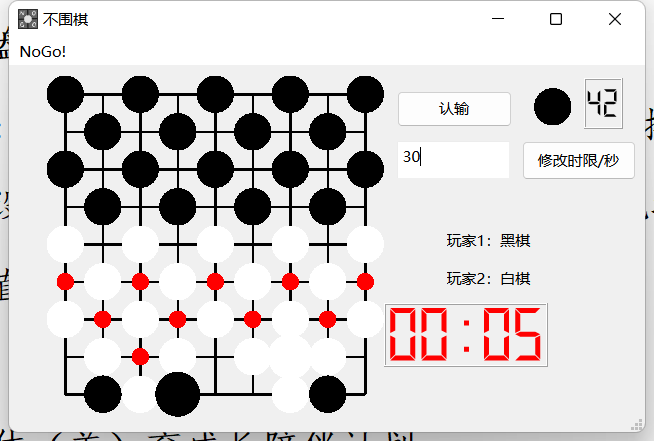
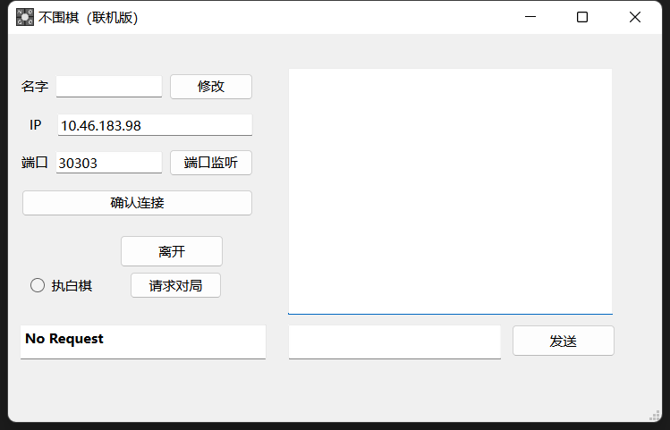
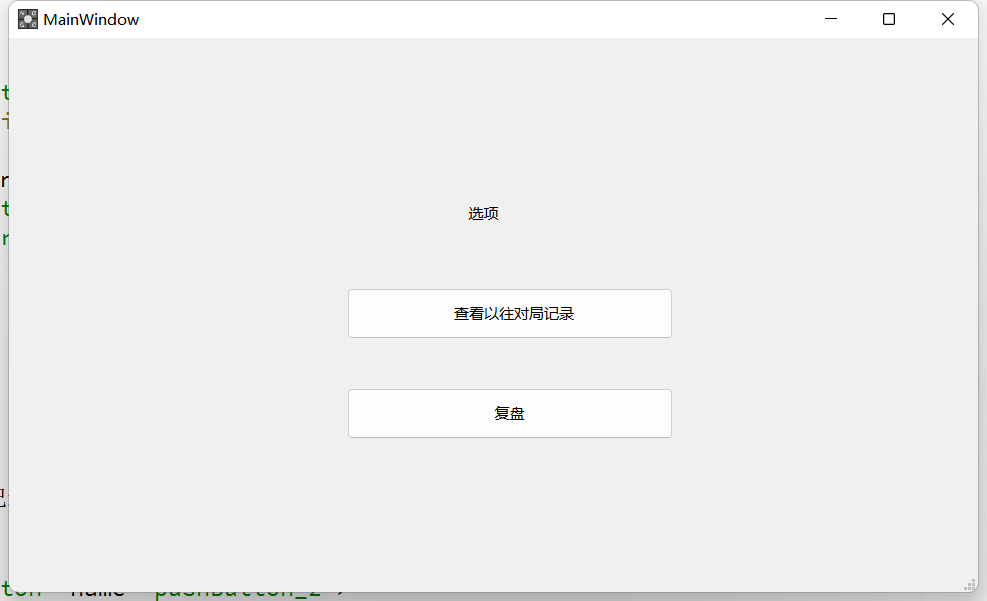
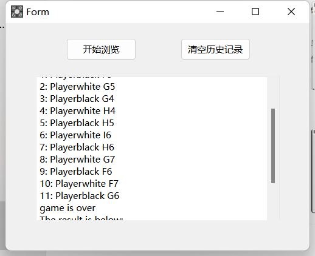
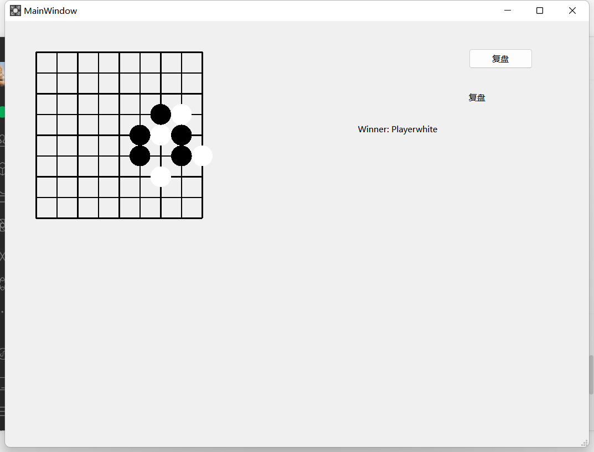

# 程序设计2荣誉课程Qt大作业第二阶段实验报告
> 周钰添撰写

## 组员分工

| 周钰添 | 李越洋 | 杜聿焜 |
| ------ | ------ | ------ |
|濒死提示|文件记录|代码调试|
|联网逻辑（全部）|多路棋盘|Debug|
|显示对局信息|||
||||

## **新增代码设计**
目前，我们的结构框架是这样的，实现了类的分离和统一使用：

### 我们新增了开始界面startwindow，可选择单机游戏、联机游戏或者是复盘。

### 我们修改了类mainwindow，**作为单机和联机游戏共同使用的界面**。
1. 濒死提示  
   
2. 倒计时提醒  
   

### 我们新增了联机类netwindow，用以实现联机操作。
  
    
    //NetWindow类的设计
    NetworkServer* server;
    NetworkSocket* socket;
    QString MyName;
    QString HisName;
    QString IP;
    int PORT;
    int MyColor;
    int ServerorSocket;//目前是服务端还是客户端:服务端为1，客户端为2；
    QTcpSocket* ConnectedOne;//作为服务端时，已连接机器的IP
    void closeEvent(QCloseEvent *event);//关闭行为
    void win(int );//胜利和失败弹窗
    void lose(int ); 
    void CodetoNumber(QString code);//编码与棋盘位置转换
    //服务端信息处理函数
    void receiveDataFromSocket(QTcpSocket* client, NetworkData data);
    //客户端信息处理函数
    void receiveDataFromServer(NetworkData data);
    void reset();//一键重设姓名、IP和端口并连接
    void resetName();//重设姓名
    void reStart();//重启服务端
    void reConnect();//重启客户端
    void SendChat();//发送聊天信息
    void SendRequest();//发送对局请求
    void StartGame();//开始对局
    void RejectGame(QString );//拒绝对局
    void Move(int ,int );//发送落子位置
    void ReturnStart();//窗口被关闭时，唤出主窗口
    void GameRequest(QString ,QString ); //弹出对局邀请
    void Leave();     //离开函数
    //是否在对局
    bool onGame;
    //是否己方已发送投降、自杀、超时信号
    bool SuicideSent;
    bool GiveUpSent;
    bool TimeoutSent;
    void init(); //重置参数
    
    MainWindow * m;//主游戏窗口
    Ui::NetWindow *ui;

特点：
1. 不显性区分客户端与服务端，而是在确认对局时再进行客户端和服务端的区分。
   点击“端口监听”即可充任服务端，但是同时也可以通过“确认连接”作为客户端发起连接。
2. 单机模式与联机模式使用同一个棋盘窗口，有一定的通用性。
    但是复盘模式未能使用该棋盘窗口，抽象程度不够高。

接下来是李越洋同学设计的文件记录与读取，以及最终复盘功能。
对局记录被存储在同一文件之中，通过复盘功能可复盘最近一局。

## 遇到的问题和解决方法

1. 在联机模式中，第二次落子时一定发生闪退。
   
   解决办法：通过qDebug输出的方式定位到问题在于将落子位置转换成编码这一步骤。发现是QString对于char *的类型转换需要以'\0'结尾，而我们的转换过程中疏漏了这一点。在这个bug解决之后，联机行棋就完全跑通了。

2. 由于3人使用同一github分支，远程库出现混乱，一度用github.com和微信来传输代码。
   尚待整理。
3. 在同一次运行中，程序担任服务端或者客户端后不能再担任另一端。  

   解决办法：利用函数调整程序中关于客户端和服务端的参数，在连接断开后高度地初始化。
## 感谢

* 感谢孙亚辉老师，潘俊达助教，王卓冉助教在学习和生活上的关心和指导
* 感谢杨东录team等的跨组测试
* 感谢小组成员们的共同努力与耐心协作
* 感谢中国人民大学信息学院提供的教学平台