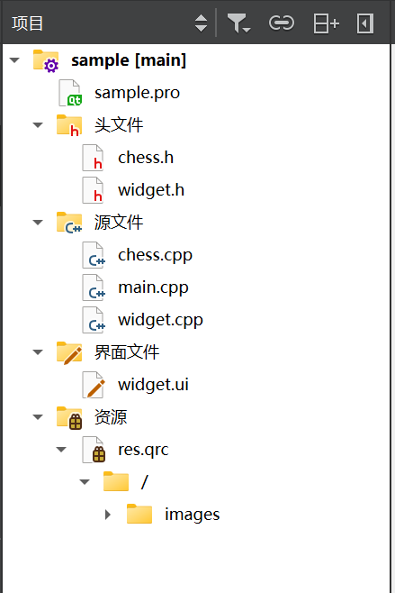
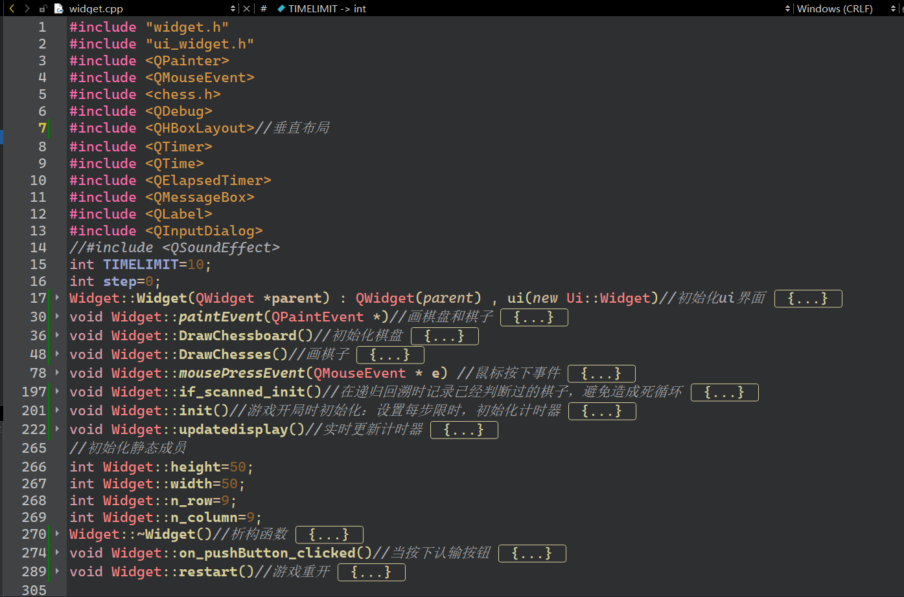
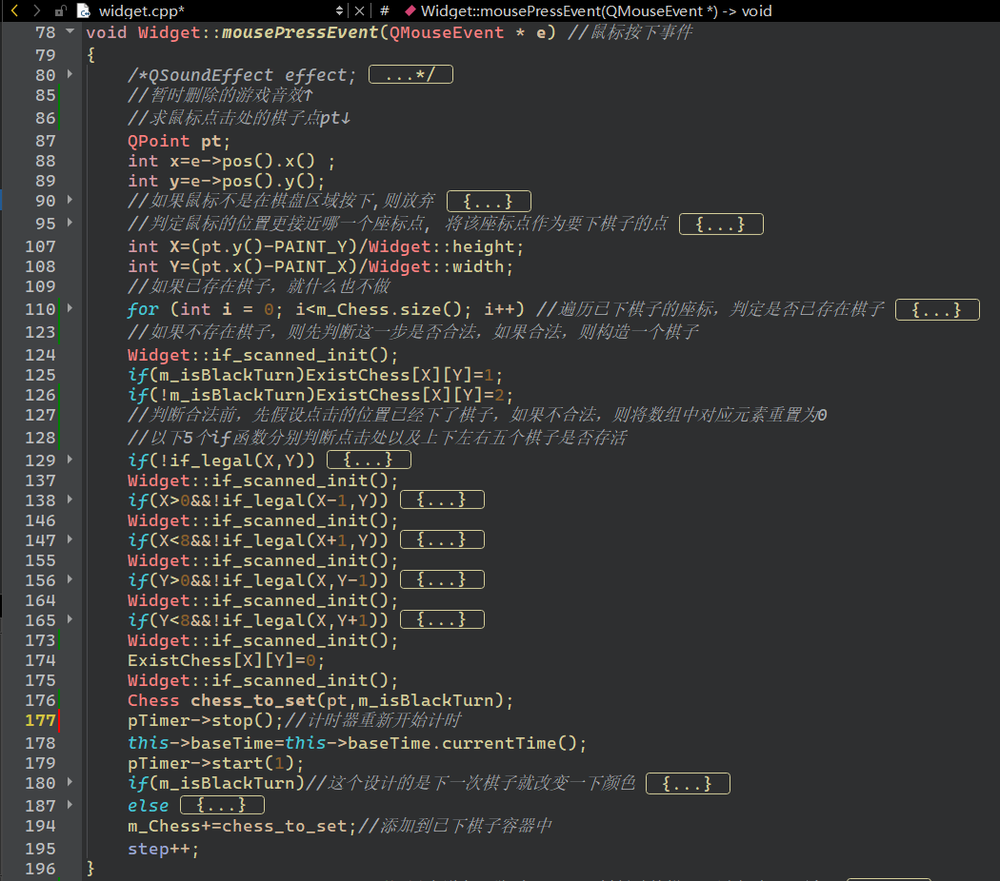
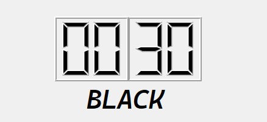

## 第五组NOGO大作业report_1

> 本报告由第五组成员于佳鑫主要编写，李屹桦，杨东录同学辅助编写。

### 小组分工

* 于佳鑫同学实现了棋盘设置, 页面初步美化以及下棋逻辑的实现等

* 李屹桦同学实现了判断落子合法判断，计时器的实现和参数化和棋盘页面美化等

* 杨东录同学实现了计时器的实现，页面初步美化，下棋步数的统计以及giveup的实现等

### 具体实现
#### 代码框架

> 简洁美丽o(*￣▽￣*)ブ

> 这是widget.cpp的概览

> ”鼠标按下事件“函数的概览

#### 代码简介

* ui界面展示

  

* ##### 棋盘&棋子

  * 棋盘和棋子均采用了image图片，这样比较美观

   

  * 在chess.h中，我们定义了棋子的成员，其中位置采用了Qpoint；在widget中，我们采用vector容器来记录已下的棋子

  > 符合***低耦合***的要求

  * 下棋的逻辑就是判断是否vector中已经有棋子，没有就下在最近的坐标点上，有则return

* ##### 落子合法判断

  * 计算即将下的棋子的气以及周围棋子的气，采用递归的方法，非常👌
  * 由于一切将会导致有棋子被吃掉的下法都会被阻止（这个功能似乎在stage2里面），因此输掉一局游戏的方式只有认输或超时。

* ##### 计时器

  

  > 将时间限制设置为一个可以调节的参数：）

  

  * 采用艺术化的字体，让玩家体会到数字之美

* ##### 其他巧思

  * 如果下了不合法的位置

    

  * 计算了下棋步数

    
    
  * 我们曾经尝试在游戏中插入音频来增强趣味性，但考虑到生成的莫名其妙的超过100MB的qrc文件以及程序在其他人电脑上可能无法运行等因素，我们暂时取消了代码中与多媒体相关的内容。

### 遇到的困难

* 代码中有很多warning，但程序能正常运行，我们暂时忽视这些warning，不知道以后会不会做出改进。
* 我们曾经尝试把不同功能的函数放到不同的文件里，但程序总是无法正常运行，因此我们只好暂时把大多数函数都塞到了同一个文件的Widget类里面（至少能正常运行）。

### 感谢

* 感谢孙亚辉老师，潘俊达助教，王卓冉助教在学习和生活上的关心和指导
* 感谢由于佳鑫，李屹桦，杨东录组成的team5
* 感谢中国人民大学信息学院提供的教学平台

