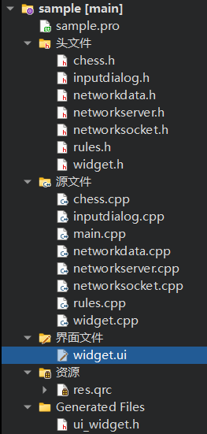
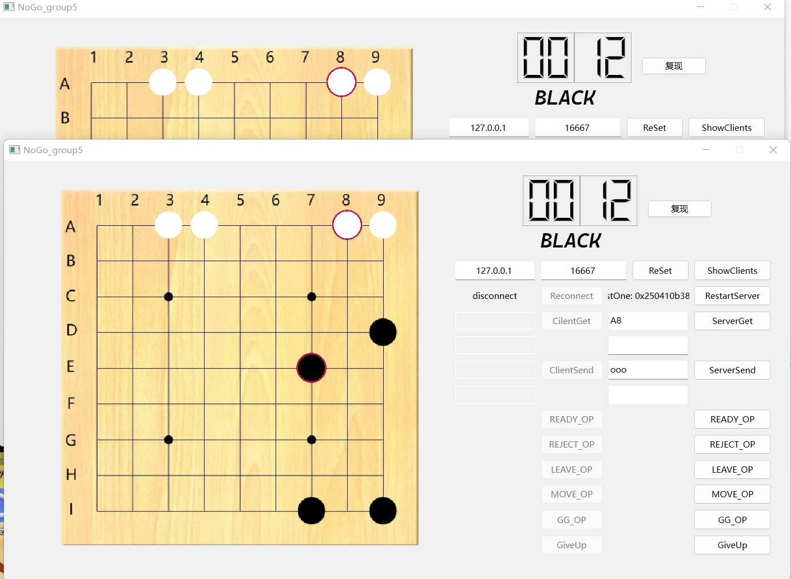
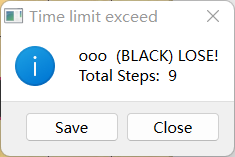
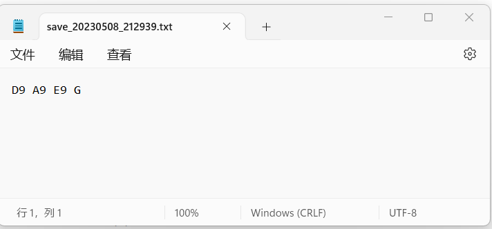
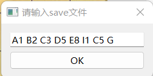
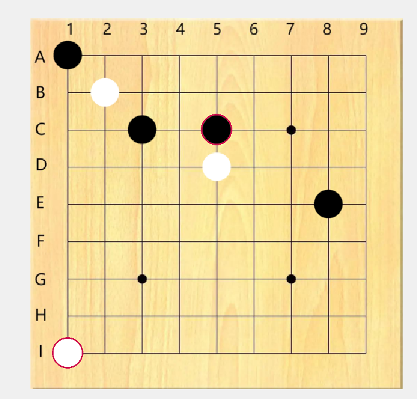

## 第五组NOGO大作业report_2

> 本报告由于佳鑫同学主要编写，李屹桦、杨东录同学辅助编写。

### 小组分工

* 于佳鑫同学为本报告的主要编写者，并实现了游戏逻辑部分，包括但不限于

  * 3.保存行棋记录到本地 、复现棋盘；
  * 4.高亮对手和自己最近一步棋子；
  
  >  1.2.6.在上一阶段已经实现
  
* 杨东录同学实现了：

    * 1.网络的雏形与后续的拟合
    * 2.READY_OP,MOVE_OP,LEAVE_OP,MOVE_OP的实现

* 李屹桦同学:

    * 把助教给的demo有机地融合进我们的Widget中，大大增加了widget.cpp文件的代码长度
    * 经过艰难尝试，终于分出了一个判断落子是否合法的Rules类
    * 5.实现11和13路不围棋：这是在stage1文件的基础上稍加修改做出来的，与9路联网不围棋文件相互独立。（显然这是不行的，后续我们会增加一个选择游戏模式的界面）
    * 实现GG_OP，在巨大的知二1619宿舍与杨东录同学合作完成各种OP的实现，并且调试联网功能

    

### 代码简介



将网络部分的networkdata、networkserver、networksocket类移植入我们的项目，并将mainwindow中的所有mainwindow全部改为widget并插入widget.cpp。

chess类用来画棋子，inputdialog类用来复现棋盘，rules类用来判断落子是否合法。

> 900多行的widget.cpp，体现了本组同学高超的读代码能力（
>
> 理论上还应该有一部分代码可以继续封装成单独的类，但由于总是无法处理两个类互相调用的情况，因此除了Rules类、Chess类、InputDialog类成功分离，其他要调用Widget成员，使用Widget的this指针的函数均没能成功分离。

widget.h中新增网络内容：

```cpp
public:
    QString clientName;
    QString serverName;
    int twice;
    int X_Other;
    int Y_Other;
    bool is_server=false;
    bool is_client=false;
    void DrawChess(int X,int Y);
    bool client_color_white=false;
    bool server_color_black=false;
    // 服务端
    NetworkServer* server;
    // 客户端
    //NetworkData data;
    NetworkSocket* socket1;
    NetworkSocket* socket;
    // 最后一个客户端
    QTcpSocket* lastOne;
    QString IP;
    int PORT;
    // 客户端池，NetworkServer 有一个 QList 的，但这里我想用 set，所以又弄了一个
    QSet<QTcpSocket*> clients;
    int flag_start;
    int flag_color;
    int if_client;

private slots:
    void receieveData(QTcpSocket* client, NetworkData data);
    void receieveDataFromServer(NetworkData data);
    void onClientSendButtonClicked();
    void onServerSendButtonClicked();
    void reStartServer();
    void reConnect();
    void reSet();
    void on_CREADY_OP_clicked();
    void on_CREJECT_OP_clicked();
    void on_SREADY_OP_clicked();
    void on_SREJECT_OP_clicked();
    void on_CilentGiveup_clicked();
    void on_ServerGiveup_2_clicked();
    void on_CLEAVE_OP_clicked();
    void on_SLEAVE_OP_clicked();
    void TIMEOUT_END_OP_send();
```

成功分离出的Rules类：

```cpp
class Rules
{
public:
    Rules();
    int if_legal(int ExistChess[9][9],int x,int y);//判断x行y列的棋子是否存活
    int if_scanned[9][9];//在递归回溯时记录已经判断过的棋子，避免造成死循环
    void if_scanned_init();//将if_scanned数组所有元素重置为0
    bool illegal_operation_judging(int ExistChess[9][9],int X,int Y);
};
```

用来弹出复现棋盘对话框的InputDialog类：

```cpp
InputDialog::InputDialog(QWidget *parent):QDialog(parent)
{
    setWindowTitle("请输入save文件");
    m_lineEdit = new QLineEdit(this);

    m_okButton = new QPushButton("OK",this);
    connect(m_okButton,&QPushButton::clicked,this,&InputDialog::onOKButtonClicked);

    QVBoxLayout* layout = new QVBoxLayout(this);
    layout->addWidget(m_lineEdit);
    layout->addWidget(m_okButton);

}

void InputDialog::onOKButtonClicked()
{
    emit inputFinished(m_lineEdit->text());
    close();
}
```


### UI展示

双人对战演示：



结算画面：



### 具体实现

* 保存行棋记录到本地

  * 由于本组目前设计是禁止一切自杀和他杀行为，所以道理上最后结局只有give up和time limit exceed两种情况。故在行棋记录中，以G结尾代表give up，以T结尾代表time limit exceed。

    > _写完才发现原来要求里改了加T，不过这个确实是在这个要求提出前就写了的......_

  * 结束后，点击save可以保存对局信息。玩家可以选择保存在本地的位置，同时文件自动命名为“save_ 年份日期 _时分秒.txt"。

    

* 高亮对手和自己最近一步棋子

  * 设计为将对手和自己最近一次下的棋子周围画个圈圈，兼具美观和醒目👍。

    > 高亮采用的颜色为CE0B4D，灵感来源于Pantone发布的2023年度色彩"Viva Magen 18-1750"，象征着朝气、自信和勇敢。由于Pantone并没有公布潘通色号或rgb或hex值，所以本人只好从官网上找到了色卡图片并用取色器取色，最终找到了最接近的CE0B4D :D

  * 本功能在复现时也存在（废话，用的同一个画画函数
  
* 复现棋盘

  * 采用输入的方式，不局限于save文件，玩家可以根据自己的需要复现出想要实现的棋盘

  * 对输入采用宽松的限制<del>（主要是因为懒）</del>，即只要输入了正确的save格式即可复现出正确的棋盘；

    > 假如格式错误，在大多数情况下（如输入坐标不合法）可以弹窗警告输入错误，小部分情况（如将空格改为其他字符）仍可以复现出正确的棋盘，或者（输入了两个相同的坐标）两个棋子会重叠（但看不出来。。。





+ 实现客户端向服务端发起连接
  + 实践是检验真理的唯一标准，我们在同一台电脑上同时打开两个窗口进行试验，发现一方先点击“RestartServer”，另一方再点击“ReSet”即可成功连接。

+ 实现发起对局，接受和拒绝对局
  + client先输入用户名和想要执的棋子（输入“w”为白棋，否则为黑棋），并点击READY_OP，server收到消息后输入自己的用户名，并点击READY_OP，游戏开始（若点击REJECT_OP则拒绝）。当黑方落下第一个子时开始计时，因此第一步棋永远不会超时。

+ 实现联机对战通信
  + 一方落子后自动发送MOVE_OP的信号(包含落子的位置)给另一方，收到此信号的一方将自动在棋盘上画出棋子，(并转换颜色,用来限定对方回合己方不能落子）~~双方任何时候都可以投降~~只有在自己的回合才能投降。

+ 实现联机再来一局
  + 直接双方重新READY_OP就行了

+ 实现聊天
  + 吸收了demo的精华（

### 遇到的问题

* 不愿意透露姓名的两位成员曾经尝试拆分文件，都以失败告终🤡
  * 没有完全失败，至少拆分出了用来判断落子是否合法的Rules类
* 用来判断客户端、服务端、黑子、白子的if，else过多，代码需要精简。
* ui界面非常质朴，几乎没有任何的装饰（问题不大）
* 关于每步限时的设定：由于这是联机游戏，但我们不知道应该将设置时间的权限交给谁，因此暂时取消了设置时间功能，直接将其设定为一个固定值。
* 游戏的默认设定是联网对战，因此暂时难以实现本地进行11/13路不围棋的功能。
* 没有游戏缓存，重新打开游戏时不能恢复之前已经输入的ip地址以及游戏界面。

### 感谢

* 感谢孙亚辉老师，潘俊达助教，王卓冉助教在学习和生活上的关心和指导
* 感谢由于佳鑫，李屹桦，杨东录组成的team 5
* 感谢中国人民大学信息学院提供的教学平台
* 感谢巨大的1619

