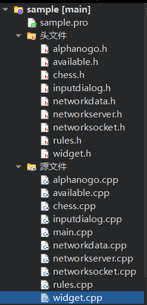
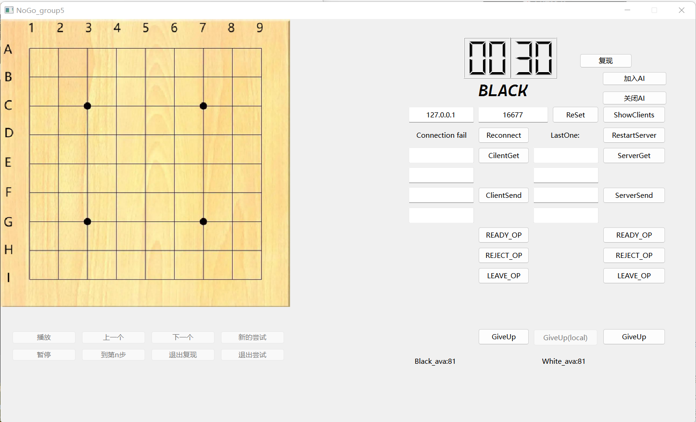

## 第五组NOGO大作业report_3

### 小组分工

* AI:  杨东录，李屹桦
* 模式选择与bug修复：李屹桦

* 附加任务1：于佳鑫

* 附加任务2：李屹桦
* 报告：于佳鑫，李屹桦，杨东录

### 代码简介

+ 在alphanogo类中实现托管下棋，在widget中增加了复现播放功能和新的尝试功能
+ 对代码做了一些小小的润色，在头文件中补充了一些注释，删去了被注释掉的大段代码

### UI界面展示

朴实无华，但删去了多余的按钮，并且在合适的时机禁用合适的按钮，避免在一种模式下进行另一种模式的操作。

### 具体实现

* AI：组员能力水平有限，再加上每步时长有3秒的限时，因此我们的AI非常低级，算法非常简单，时间复杂度极低，可能在对战中获得较低的胜率。

  + 直觉表明，第一步下天元似乎是一个不错的选择，因此当天元（E5）没有子时会在E5落子。
  
  * 我们发现，游戏获胜的本质是使对方先出现无棋可下的情况，因此当己方的可下点数减去对方的可下点数越多时，我方的局面越有利。我们的自动下棋函数构造了一个vector类型的“bests”，用来存放最佳落子点。该函数会遍历当前棋盘上所有可下的点（除去已下子的点和非法的点），计算在每一个位置下子后己方可下点数减去对方可下点数的值，如果这个值超过了之前的最大值，则将bests清空，存入当前点，如果这个值与最大值相同，则将这个点放入bests中（不清空之前已经存放的点）。
    + 如果bests容器没有元素（即无子可下），自动调用认输函数，向对方发送认输信息。
    + 如果bests容器中有元素，则随机选择一个作为返回值。
  
* 附加任务1（利用编码重新播放对局）：

  > 在原来的复现的基础上按照要求增加了一些功能。

  * 主要思路：把需要复现的棋子存在vector里，定义一个currentIndex代表需要播放的棋子的序号，把需要下的棋子加入画图的vector中，画出相应的棋子。
    * 播放&暂停：设置一个定时器，每过0.8s把currentIndex加1。暂停就是stop。
    * 上/下/到第n步：相应地改变currentIndex和vector中的元素。
    * 其他：进入复现模式前后，一些按钮会更改状态。

* 附加任务2（播放时随时介入不一样的尝试，也可以还原并继续播放）：

  > 在附加任务1的基础上增加了一些功能。

  * 主要思路：
    * 点击”新的尝试“按钮时，播放自动暂停，可以在当前局面的基础上点击棋盘下棋，进行新的尝试，点击”退出尝试“后将自动恢复到原来播放到的位置。
  
* 模式选择：

  * 在程序运行时先选择游戏模式，分为”联机9路“、”单机9路“、”单机11路“、”单机13路“。
  * 单机模式下不能进行与网络有关的任何操作；非9路模式下不能进行复现，没有AI的帮助，只能本地双人对战。

+ 其他功能详见前两个阶段的报告

### 遇到的问题

* 组员能力有限，自动下棋函数的目光比较短浅，不能做到高瞻远瞩，导致AI算法非常低级。
* 认为很多功能都限制在9路棋盘下，导致11路、13路棋盘只有本地双人对战的功能。
* 代码结构还是非常不美观，重复代码过多，受限于组员ddl缠身，我们能做出的改进比较有限。

### 感谢

* 感谢孙亚辉老师，潘俊达助教，王卓冉助教在学习和生活上的关心和指导
* 感谢由于佳鑫，李屹桦，杨东录组成的team5
* 感谢中国人民大学信息学院提供的教学平台

### 附：

项目仓库：https://github.com/Liyh04/2205

可执行文件打包在文件夹group5_final中。

github_contributors：

Liyh04（李屹桦）2022200717

MLrollIT（杨东录）2022201826

amYujx（于佳鑫）2022201895